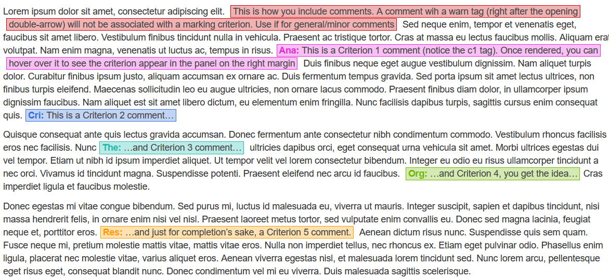

```{r setup, include=FALSE}
knitr::opts_chunk$set(echo = TRUE, eval=F)
```

This document gives a short guide on marking students' submissions. Please make sure you set things up correctly to make this as smooth an experience as it can be for all of us.

## Setting up Canvas API access

As you know, students are supposed to upload R Markdown files for this assignment, which means that we won't be able to use Canvas/Turnitin for marking. While some -- like me might call this a blessing -- this does mean that we need a smart way of downloading, marking, and uploading hundreds of documents.

Enter API, or Application Programming Interface. Simply put, an API is a way of retreiving information from and sending information to web applications *programmatically* (using code). If a web application provides an API to the average Jacinda, she can basically do anything her level of authorisation allowes her to do using the standard web interface without as much as opening her browser window. No clicking, no browsing through pages, just good old code. APIs are also very useful for web-scraping and analytics of all sorts. And Twitter and Facebook bots... :/

As luck would have it, Canvas provides a fully exposed [RESTful](https://en.wikipedia.org/wiki/Representational_state_transfer "Honestly, who comes up with these names?!") API which means that uploading all the 500+ marked submissions so that they are only visible to their author can be a matter of seconds rather than hours. In order to access the API, we first need to set up a few things.

### Get access token

First of all, you will need a Canvas access token so that you can authenticate your requests. This will allow Canvas to know who is sending the requests and check if you have the privileges to perform the actions you are attempting.

To do this, log into [Canvas](https://canvas.sussex.ac.uk/) and follow these steps:

1. Go to your account
1. Click on Settings
1. Click on "+ New access token"
1. Put something informative in the Purpose field
1. Choose and expiry date or leave blank for a permanent token (recommended)
1. Click on "Generate token"
1. **Copy the token and paste it into a text file BEFORE you close the pop-up window**
1. Save the text file (*e.g.,* canvas_token.txt) somewhere where you'll be able to find it.


\ 

## Install required `R` packages

### `rcanvas`

Unless you're good enough a coder to write your own API code (and I am certainly not), you'll need to install the `rcanvas` package from GitHub.

```{r}
# installing from GitHub requires either package remotes or devtools
remotes::install_github("daranzolin/rcanvas")
```

Feel free to peruse the [package documentation](https://github.com/daranzolin/rcanvas) to find out about all the cool stuff you can do with it.

\ 

### `googlesheets4`

This nifty package provides an interface for the Google sheets API and allows you to read Google sheets from your Drive straight into `R`. Install the CRAN version using `install.packages()`.

\ 

### `teachR`

While `rcanvas` can do some pretty nifty stuff, it isn't perfectly tailored to our needs. For instance, it doesn't provide a function to upload assignment feedback which is basically the main thing we're after. That's why you will also need the `teachR` package that extends its functionality to what we need. This is also the package we use to create the teaching materials for the module, in case you're interested in that.

Again, you'll have to install `teachR` from GitHub:

```{r}
remotes::install_github("mivalek/teachR")
```

If `R` prompts you about updating packages, it's best to update all.

\ 

### `adata`

Finally, even though we will check students' results automatically, you might want the ability to have a look at their data yourself. For that, you will need the `adata` package, from where? From GitHub.

```{r}
remotes::install_github("mivalek/adata")

red <- adata::red_data(123456)
green <- adata::green_data(123456)
```

The package only contains two functions `red_data()` and `green_data()`. They both take a candidate number as their first argument and generate a dataset for the given student.

\ 

And with that, you're all set up for the main event.

\ 

## Marking protocol

You will have received links to a marking master spread sheet hosted on Google Sheets and to a Box folder.

### Rubric and grade descriptors

Marking is done according to the following rubric criteria:

- *Analysis:* This component reflects the quality of your statistical analysis and your ability to present and interpret data. To score highly in this area, you must write your code and run your analysis thoroughly and correctly, report all the relevant statistics clearly and correctly, visualise your data appropriately, and demonstrate how well you understand what the results mean.
- *Critical Thinking:* This component captures your ability to evaluate your own and other studies' findings with a critical eye. To score highly in this area, you must discuss evidence-based criticisms of your own and other studies (not just speculations about what might have gone wrong!); and make insightful, novel, or theoretically interesting suggestions for how to continue this research in the future.
- *Theoretical Understanding:* This component looks at your knowledge and understanding of both the research question and the analysis you have done to answer it. To score highly in this area, you must demonstrate that you understand what your analysis tells you, and discuss how your analysis results do, and do not, inform the overall research question. 
- *Organisation:* This component captures your writing, both of text and of R script, and your ability to communicate clearly and scientifically. To score highly in this area, you must write clear, error-free, efficient R code; submit an RMarkdown file that knits correctly and produces a consistently and correctly formatted document; organise your report into sections, each of which summarises the relevant information accurately and succinctly; and communicate your ideas, findings, and evidence in a logical, scientific, and understandable way.
- *Research:* This component reflects the design and grounding of the study you are presenting. To score highly in this area, you must read and reference a variety of academic sources, beyond those given as suggested readings or on the reading list; draw on these wider readings to inform your ideas and understanding of the study; and implement a research design that is appropriate to answer the research question.

You should also have a look at [grade descriptors for each criterion](https://sussex.app.box.com/s/o5nalmzuj6u26w6hh12dq2ni4bks1a37)


<span style="color:red; font-weight:bold">[ TO BE COMPLETED ]</span>

\ 

### Marking spreadsheet

Here is where we store the information about students reports, such as file names, candidate numbers, code/knit checks and so on. It is also where you will enter the marks and final grades you are awarding the individual submissions.

<div class="warn">**Please do not delete or hide any rows or columns of this spreadsheet as doing so might break the whole thing!**</div>

\ 

### Box folder

<div class="warn">
**To edit based on whether or not .Rmd and .thml can be hosted publically**

- if so, also say the files are linked to from the spreadsheet!
</div>

In the folder you will find subfolders with your name. Each subforlder contains:

- the zipped submitted .Rmd files checked for word limit
- the zipped knitted and augmented .html files
- a marking_script.R with code used to knit the marked .Rmd files into HTML documents
- canvas_upload.R file with code that uploads the individual HTML files as feedback attachemts to each of your students' submission.
  
You will also use your subfolder to upload marked .Rmd files.

\ 

### Pre-knitted HTML documents

Before the files get to you, they will be checked for word count and results. The HTML files in your Box folder will include the correct results and, if the report exceeds the word limit, a note saying so inserted in the appropriate place in the report.

An example of such a file is below (you can see the full-size document with a wider layout [here](https://mivalek.github.io/adata/marking/marking_example.html)).

<div class="iframe"><iframe src="https://mivalek.github.io/adata/marking/marking_example.html" height="700px"></iframe></div>

### .Rmd files to mark

The R Markdown files in your Box folder are slightly edited versions of the original students' submissions. The edits are as follows:

- Comments in code are removed
- All `install.packages()` commands are removed
- If word limit is exceeded a line of HTML code is inserted
- A block of feedback HTML and Markdown is appended to the end of the file

The latter looks like this:

```
</div>

\ 

<a name="feedback"></a>
<div class="feedback">
<!-- THE GOOD -->


<!-- THE BAD -->


<!-- RECOMMENDATIONS -->
```

This is where you enter your general feedback on students' work. 

<div class="warn">**Please do not delete any part of this code!**</div>

An example Rmd file corresponding to the HTML document above can be found [here](https://mivalek.github.io/adata/marking/marking_example.Rmd) (link will download the file).

\ 

## Commenting on .Rmd files

### In-line comments

The marked .Rmd files are knitted using the `teachR::mark()` function that allows additional markdown for comments in body text. These comments are fenced off with <code>&lt;--tag [your comment]--&gt;</code>. There are 6 recognised tags: `warn` for general comments/warnings and `c1` to `c5` for comments on each of the marking rubric criteria.

To illustrate, the following comments:

<pre>
<code>
Lorem ipsum dolor sit amet, consectetur adipiscing elit. <sep style="color:red">&lt;--warn This is how you include comments. A comment with a warn tag (right after the opening double-arrow) will not be associated with a marking criterion. Use it for general/minor comments--&gt;</sep> Sed neque enim, tempor et venenatis eget, faucibus sit amet libero. Vestibulum finibus tincidunt nulla in vehicula. Praesent ac tristique tortor. Cras at massa eu lectus faucibus mollis. Aliquam erat volutpat. Nam enim magna, venenatis ut luctus ac, tempus in risus.<sep style="color:red">&lt;--c1 This is a Criterion 1 comment (notice the c1 tag). Once rendered, you can hover over it to see the criterion appear in the panel on the right margin--&gt;</sep> Duis finibus neque eget augue vestibulum dignissim. Nam aliquet turpis dolor. Curabitur finibus ipsum justo, aliquam accumsan ex ornare ac. Duis fermentum tempus gravida. Sed porta ipsum sit amet lectus ultrices, non finibus turpis eleifend. Maecenas sollicitudin leo eu augue ultricies, non ornare lacus commodo. Praesent finibus diam dolor, in ullamcorper ipsum dignissim faucibus. Nam aliquet est sit amet libero dictum, eu elementum enim fringilla. Nunc facilisis dapibus turpis, sagittis cursus enim consequat quis.<sep style="color:red">&lt;--c2 This is a Criterion 2 comment...--&gt;</sep>

Quisque consequat ante quis lectus gravida accumsan. Donec fermentum ante consectetur nibh condimentum commodo. Vestibulum rhoncus facilisis eros nec facilisis. Nunc<sep style="color:red">&lt;--c3 ...and Criterion 3 comment...--&gt;</sep> ultricies dapibus orci, eget consequat urna vehicula sit amet. Morbi ultrices egestas dui vel tempor. Etiam ut nibh id ipsum imperdiet aliquet. Ut tempor velit vel lorem consectetur bibendum. Integer eu odio eu risus ullamcorper tincidunt a nec orci. Vivamus id tincidunt magna. Suspendisse potenti. Praesent eleifend nec arcu id faucibus.<sep style="color:red">&lt;--c4 ...and Criterion 4, you get the idea...--&gt;</sep>Cras imperdiet ligula et faucibus molestie.

Donec egestas mi vitae congue bibendum. Sed purus mi, luctus id malesuada eu, viverra ut mauris. Integer suscipit, sapien et dapibus tincidunt, nisi massa hendrerit felis, in ornare enim nisi vel nisl. Praesent laoreet metus tortor, sed vulputate enim convallis eu. Donec sed magna lacinia, feugiat neque et, porttitor eros.<sep style="color:red">&lt;--c5 ...and just for completion's sake, a Criterion 5 comment.--&gt;</sep> Aenean dictum risus nunc. Suspendisse quis sem quam. Fusce neque mi, pretium molestie mattis vitae, mattis vitae eros. Nulla non imperdiet tellus, nec rhoncus ex. Etiam eget pulvinar odio. Phasellus enim ligula, placerat nec molestie vitae, varius aliquet eros. Aenean viverra egestas nisl, et malesuada lorem tincidunt sed. Nunc lorem arcu, pellentesque eget risus eget, consequat blandit nunc. Donec condimentum vel mi eu viverra. Duis malesuada sagittis scelerisque.
</code></pre>

...will render like this:



In-text comments are interactive and on hover a box with the criterion description appears on the right hand side edge of the screen (you can try it yourself <a href="#marked-html">below</a>)

\ 

### Code chunk comment

The reason why all code comments get stripped in pre-processing is so that you can use them to comment on students' code. Use them the same way you would use ordinary `#comments`. Once knitted, the leading hash will get removed and the comments will be formatted similarly to the in-text comments.

For instance, the following code chunk:


...will render like this:


\ 

### Feedack

As mentioned [above][.Rmd files to mark], there's some extra HTML/Markdown appended to the end of the students' .Rmd files. This is where you give general summary feedback on their performance. Any R Markdown will work normally. In post-processing, the three placeholders (<code><i>&lt;!&ndash;- THE GOOD -&ndash;&gt;</i></code>, <code><i>&lt;!&ndash;- THE BAD &ndash;-&gt;</i></code>, and <code><i>&lt;!&ndash;- RECOMMENDATIONS &ndash;-&gt;</i></code>) will get replaced by boilerplate text (see bottom of the example document <a href="#marked-html">below</a>). That means that it's enough for you just to include a few bulletpoints highlighting the report's strengths, weaknesses, and giving some general recommendations for improvement.

\ 

<a name="marked-html"></a>
Once a marked and commented .Rmd file has been knitted, it will look like the example below (you can see the full-size document with a wider layout [here](https://mivalek.github.io/adata/marking/marked_example_marked.html)). As mentioned, the in-line comments are interactive and reveal the matching rubric criterion description on hover. The boxes with partial grades per criterion are also interactive and when clicked, reveal the grade descriptor.

<div class="iframe"><iframe src="https://mivalek.github.io/adata/marking/marked_example_marked.html" height="700px"></iframe></div>

\ 

## Awarding marks

Even though the mark scale spans the [0, 100] interval, the university marking policy doesn't allow all the values within this range. Please only award marks listed in [the grade descriptor document](https://sussex.app.box.com/s/o5nalmzuj6u26w6hh12dq2ni4bks1a37), namely:

- 0, 10, 20, 30
- 35, 38
- 42, 45, 48,
- 52, 55, 58,
- 62, 65, 68
- 72, 75, 78,
- 82, 88,
- 95

Mark the reports on each of the rubric criteria and award a numeric mark, entering it in the Google sheet. The spreadsheet then calculates the average of the five marks and shows it in the "suggested_grade" column. This mark is not binding for you as the marker but you should have a good reason for big departures from it in the total grade you enter in the "grade" column. Please bear in mind that the total grade should also follow the marking policy and its numeric value should only be one of the allowed ones. For example, you can use the suggest grade to help you decide whether to mark up or down on a grade boundary (e.g. either a 62 or a 58, since you cannot give a 60).

\ 

## Knitting marked .Rmd files

Once you have commented all .Rmd files and entered all the partial and total grades in the marking spreadsheet, you will need to knit the files to produce the augmented HTML documents. The code for this will have been shared with you (marking_script.R).

The only thing you need to edit in the script before your run it is the bit towards the beginning:

```{r, eval=F, echo=T}
######################## EDIT AS APPROPRIATE ################################
# You must use the name in the Google spreadsheet!
marker <- "Milan"
# EDIT PATH to where you saved students' .Rmd files
marking_path <- "marking/AnD/2019-20"
#############################################################################
```

The path should point to the folder where you saved the commented .Rmd files. The files should not be in separate subfolders.

Once you've made these two edits, you can run the code, sit back and watch it do its thing. Or better still, go get a cuppa; with 50+ reports per marker, this can take a while.

\ 

## Uploading marked HTML files

Before the knitted files can be uploaded back onto Canvas, the marked reports need to undergo moderation. The module covenor will let you know once this has been done and ask you to go ahead and upload the files.

To do that, you should run the code in the canvas_upload.R script that will have been shared with you. Once, again, there are two things you need to edit before you can run the code:

1. Change the path to point it to the folder with the knitted HTML files.
1. Insert your [Canvas access token][Get access token] inside the "s.

```{r, eval=F, echo=T}
######################## EDIT AS APPROPRIATE ################################
# EDIT PATH to where you saved students' .Rmd files
fpath <- "marking/AnD/2019-20"
# insert your Canvas token
set_canvas_token("")
#############################################################################
```

The code will then amend any marks that have been changed in moderation <span style="color:red; font-weight:bold">[ TO DO! ]</span> and upload the HTML documents as feedback attachments to each individual student submission. Again, this may take a minute.

\ 

## Procedure overview

Now that you are familiar with the individual components of the marking protocol, all you need to do is follow these few steps.

<div class="solText">
1. Complete the setup detailed above.
    - Get and save a [Canvas access token][Get access token]
    - Install the `rcanvas`, `googlesheets4`, `teachR`, and `adata` [packages][Install required `R` packages].
1. Follow the Box link and download the .R, .Rmd and .html files from your folder.
1. Open the marking master Google spreadsheet.
1. Read the HTML file while commenting on the report inside the .Rmd file as detailed [above][Commenting on .Rmd files].
    - **Do not change the file names!**
1. [Enter marks][Awarding marks] per each rubric criterion and a total grade into the Google spreadsheet.
1. Once you have marked all reports, run the code inside marking_script.R, [editing as appropriate][Knitting marked .Rmd files].
1. Upload all marked .Rmd files back into your Box folder.
1. Once you get the thumbs up from the module convenor, run the code inside canvas_upload.R to [upload the files back onto Canvas][Uploading marked HTML files].
1. Check a few submissions on Canvas to see if the upload went through and that matching files were attached to students' submissions.
1. Email the module convenor, cc'ing the lecturers, letting them know that you have finished the upload.
1. If you have any issues, please let us know as soon as possible.

</div>

\ 

\ 

That is all you need to know to get going on the marking. Thank you so much for all your hard work!

