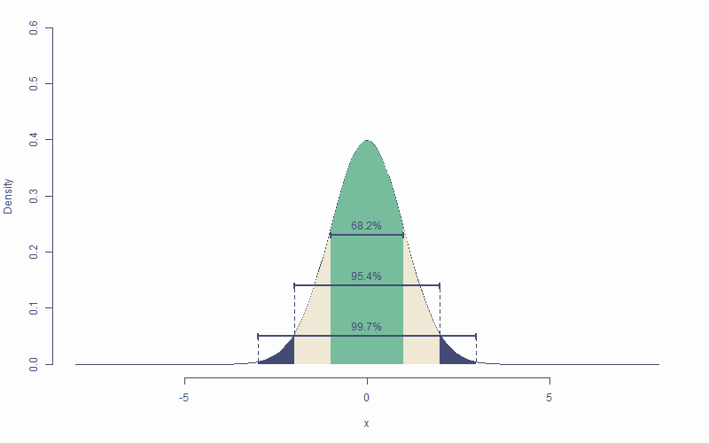
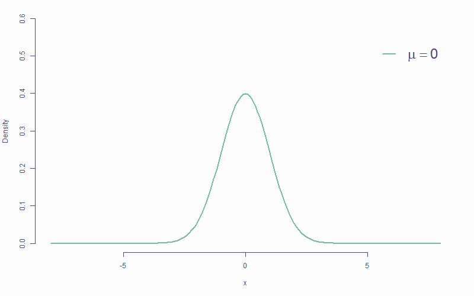
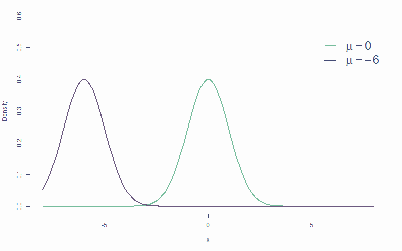
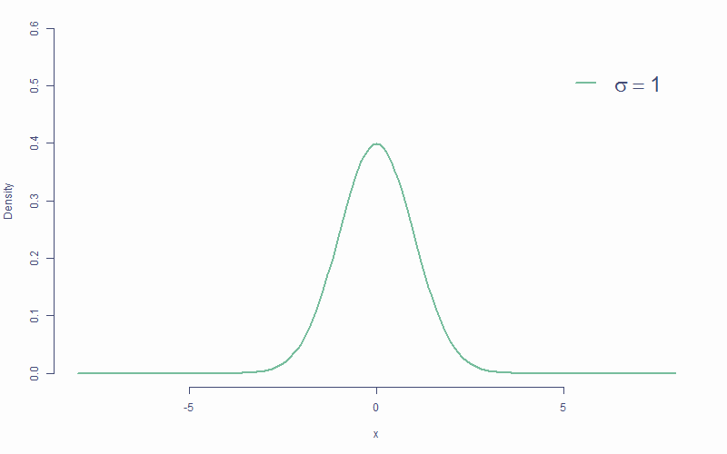
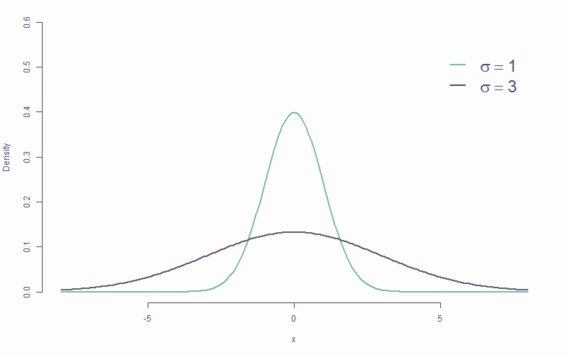
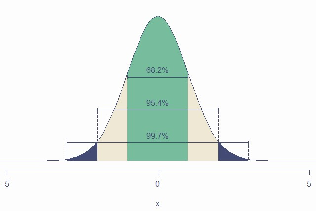
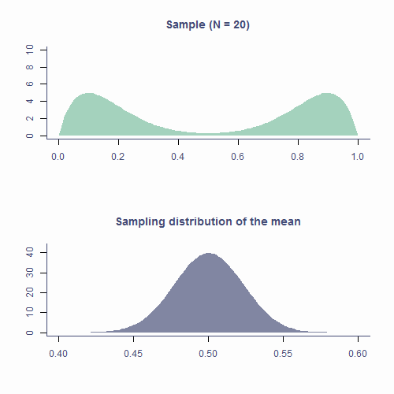

## Today

- Normal distribution
- Sampling
- Sampling distribution
- Standard error
- Central Limit Theorem

## It's all Greek to me!

- $\mu$ is the *population* mean
- $\bar{x}$ is the *sample* mean
- $\hat{\mu}$ is the **estimate** of the *population* mean
- Same with *SD* -- $\sigma$, $s$, and $\hat{\sigma}$
- Greek is for populations, Latin is for samples, hat is for population estimates

## Recap on distributions

- Numerically speaking, the number of observations per each value of a variable
- Which values occur more often and which less often
- The shape formed by the bars of a bar chart/histogram

```{r, echo = F, fig.width=8}

### DEFAULT ggplot THEME NOW SET By make.sheet() and Slidify()
# library(colortools)
# 
# bg_col <- "#fdfdfd"
# default_col <- "#434b75"
# theme_col <- "#77bd9d"
# complement_col <- complementary(theme_col, plot = F)[2]

set.seed(1234)
library(tidyverse)

df <- tibble(eye_col = sample(c("Brown", "Blue", "Green", "Gray"), 555,
                        replace = T, prob = c(.55, .39, .04, .02)),
             age = rnorm(length(eye_col), 20, .65))

p1 <- df %>%
  ggplot(aes(x = eye_col)) +
  geom_bar(fill = c("skyblue4", "chocolate4", "slategray", "olivedrab")) +
  labs(x = "Eye colour", y = "Count")

p2 <- df %>%
  ggplot(aes(x = age)) +
  geom_histogram() +
  stat_density(aes(y = ..density.. * 80), geom = "line", color = theme_col, lwd = 1) +
  labs(x = "Age (years)", y = "Count")
  
plot_grid(p1, p2)
```

### Known distributions

- Some shapes are "algebraically tractable", *e.g.,* there is a maths formula to draw the line
- We can use them for statistics

```{r, echo = F}
df <- tibble(x = seq(0, 10, length.out = 100),
             norm = dnorm(scale(x), sd = .5),
             chi = dchisq(x, df = 2) * 2,
             t = dt(scale(x), 5, .5),
             beta = (dbeta(x / 10, .5, .5) / 4) - .15)

cols <- c("#E69F00", "#56B4E9", "#009E73", "#CC79A7")
df %>%
  ggplot(aes(x = x)) +
  geom_line(aes(y = norm), color = cols[1], lwd = 1) +
  geom_line(aes(y = chi), color = cols[2], lwd = 1) +
  geom_line(aes(y = t), color = cols[3], lwd = 1) +
  geom_line(aes(y = beta), color = cols[4], lwd = 1) +
  labs(x = "x", y = "Density")
```

### The normal distribution

- AKA Gaussian distribution, The bell curve
- The one you **need to** understand
- Symmetrical and bell-shaped

### The normal distribution {data-transition="none-out"}

- Not every symmetrical bell-shaped distribution is normal
- It's also about the proportions -- fixed

{height=450px}

### The normal distribution {data-transition="fade" data-gif="repeat"}

- Peak/centre of the distribution is its mean (also mode and median)
- Changing mean (**centring**) shifts the curve left/right

{height=450px}

### The normal distribution {data-transition="fade" data-gif="repeat"}

- Peak/centre of the distribution is its mean (also mode and median)
- Changing mean (**centring**) shifts the curve left/right

{height=450px}

### The normal distribution {data-transition="fade" data-gif="repeat"}

- Peak/centre of the distribution is its mean (also mode and median)
- Changing mean (**centring**) shifts the curve left/right

{height=450px}

### The normal distribution {data-transition="fade"}

- *SD* determines steepness of the curve (small $\sigma$ = steep curve)
- Changing *SD* is also known as **scaling**

{height=450px}

### The normal distribution {data-transition="fade" data-gif="repeat"}

- *SD* determines steepness of the curve (small $\sigma$ or $s$ = steep curve)
- Changing *SD* is also known as **scaling**

{height=450px}

### The normal distribution {data-transition="fade" data-gif="repeat"}

- *SD* determines steepness of the curve (small $\sigma$ or $s$ = steep curve)
- Changing *SD* is also known as **scaling**

{height=450px}

#### Area below the normal curve

- No matter the particular shape of the given normal distribution, the proportions with respect to *SD* are the same
    - **&sim;68.2%** of the area below the curve is within **&plusmn;1 *SD*** from the mean
    - **&sim;95.4%** of the area below the curve is within **&plusmn;2 *SD*** from the mean
    - **&sim;99.7%** of the area below the curve is within **&plusmn;3 *SD*** from the mean
- We can calculate the proportion of the area with respect to any two points

#### Area below the normal curve

{height=550px}

#### Area below the normal curve

- Say we want to know the number of *SD*s from the mean beyond which lie the outer 5% of the distribution

```{r, echo = F, fig.height=3}
quantiles <- qnorm(.025) * c(-1, 1)
tibble(x = sort(c(quantiles, seq(-4, 4, by = .1))), y = dnorm(x, 0, 1)) %>%
  ggplot(aes(x, y)) +
  geom_line(color = default_col) +
  geom_density(data = ~ subset(.x, x >= quantiles[1]), stat = "identity", color = NA, fill = theme_col) +
  geom_density(data = ~ subset(.x, x <= quantiles[2]), stat = "identity", color = NA, fill = theme_col) +
  geom_line(data = tibble(x = rep(quantiles, each = 2), y = c(0, .15, 0, .15)),
            aes(x, y, group = x), lty = 2, color = default_col) +
  geom_segment(data = tibble(x = quantiles, xend = c(4, -4), y = c(.15, .15), yend = c(.15, .15)),
               aes(x = x, xend = xend, y = y, yend = yend),
               arrow = arrow(length = unit(0.2, "cm"), angle = 15, type = "closed"),
               color = default_col) +
  annotate("text", x = c(-2.8, 2.8), y = .18, label = ("2.5%"), color = default_col) +
  labs(x = "z-score", y = "Density")
```

```{r}
qnorm(p = .025, mean = 0, sd = 1) # lower cut-off
qnorm(p = .975, mean = 0, sd = 1) # upper cut-off
```

#### Critical values

- If *SD* is known, we can calculate the cut-off point (critical value) for **any proportion** of normally distributed data

```{r}
qnorm(p = .005, mean = 0, sd = 1) # lowest .5%
qnorm(p = .995, mean = 0, sd = 1) # highest .5%

# most extreme 40% / bulk 60%
qnorm(p = .2, mean = 0, sd = 1)
qnorm(p = .8, mean = 0, sd = 1)
```

- Other known distributions have different cut-offs but the principle is the same

## Sampling from distributions

- Collecting data on a variable = randomly sampling from distribution
- The underlying distribution is often assumed to be normal
- Some variables might come from other distributions
    - Reaction times: *log-normal* distribution
    - Number of annual casualties due to horse kicks: *Poisson* distribution
    - Passes/fails on an exam: *binomial* distribution

## Sampling from distributions

- Samples from the same population differ from one another

```{r}
# draw a sample of 10 from a normally distributed
# population with mean 100 and sd 15
rnorm(n = 6, mean = 100, sd = 15) 

# repeat
rnorm(6, 100, 15) 
```

## Sampling from distributions

- Statistics ($\bar{x}$, $s$, <i>etc.</i>) of two samples will be different
- **Sample** statistic (<i>e.g.</i>, $\bar{x}$) will likely differ from the **population** parameter (<i>e.g.</i>, $\mu$)

```{r}
sample1 <- rnorm(50, 100, 15); sample2 <- rnorm(50, 100, 15)

mean(sample1); mean(sample2)
```

```{r, echo = F, fig.height=2.7, fig.width=7}
p1 <- ggplot(NULL, aes(x = sample1)) +
  geom_histogram(bins = 15) +
  geom_vline(xintercept = mean(sample1), color = theme_col, lwd = 1) +
  labs(x = "x", y = "Frequency") + ylim(0, 8)
p2 <- ggplot(NULL, aes(x = sample2)) +
  geom_histogram(bins = 15) +
  geom_vline(xintercept = mean(sample1), color = theme_col, lwd = 1) +
  labs(x = "x", y = "") + ylim(0, 8)

plot_grid(p1, p2)
```

## Sampling distribution

- If we took all possible samples of a given size (say *N = 50*) from the population and each time calculated $\bar{x}$, the means would have their own distribution
- This is the **sampling distribution** of the mean
    - Approximately **normal**
    - Centred around the **true population mean**, $\mu$
- Every statistic has its own sampling distribution (not all normal though!)

## Sampling distribution

```{r}
x_bar <- replicate(100000, mean(rnorm(50, 100, 15)))
mean(x_bar)
```

```{r, echo=F, fig.height=3.5, fig.width=6}
ggplot(NULL, aes(x_bar)) +
  geom_histogram(bins = 51) +
  geom_vline(xintercept = mean(x_bar), col = theme_col, lwd = 1) +
  labs(x = "Sample mean", y = "Frequency") 
```

### Standard error

- Standard deviation of the sampling distribution is the **standard error**

```{r}
sd(x_bar)
```

- Sampling distribution of the mean is *approximately normal*: *~68.2% of means of samples* of size 50 from this population will be *within &plusmn;`r round(sd(x_bar), 2)` of the true mean*

### Standard error

- Standard error can be **estimated** from any of the samples
<m>$$SE = \frac{SD}{\sqrt{N}}$$</m>

```{r}
samp <- rnorm(50, 100, 15)
sd(samp)/sqrt(length(samp))

# overestimate compared to actual SE
sd(x_bar)
```

- If ~68.2% of sample means lie within &plusmn;`r round(sd(samp)/sqrt(length(samp)), 2)`, then there's a ~68.2% probability that $\bar{x}$ will be within &plusmn;`r round(sd(samp)/sqrt(length(samp)), 2)` of $\mu$

```{r}
mean(samp)
```

### Standard error

- *SE* is calculated using *N* -- there's a relationship between the two

```{r, echo = F, fig.width=8, fig.height=4.5}
tibble(x = 30:500, y = sd(samp)/sqrt(30:500)) %>%
  ggplot(aes(x, y)) + geom_line(lwd=1, color = theme_col) + labs(x = "N", y = "SE") +
  annotate("text", x = 400, y = 2.5, label = bquote(sigma==.(round(sd(samp), 1))), color = default_col, size = 10)
```

### Standard error

- That is why *larger samples are more accurate*!

\ 

```{r, echo = F, fig.width=8, fig.height=4.5}
x_coord <- c(seq(10, 35, by = .5), 36:150, seq(151, 200, by = 2), 200)
n <- length(x_coord)
cbind(seq(85, 115, length.out = 300),
      sapply(x_coord,
             function(x) dnorm(seq(85, 115, length.out = 300), 100, 15/sqrt(x)))) %>%
  as_tibble() %>%
  set_names(c("x", paste0("y_", sprintf("%03d", 1:n)))) %>%
  gather("group", "y", starts_with("y")) %>%
  separate(group, c("var", "n"), "_", convert = T) %>%
  ggplot(aes(x, y, group = n, color = n)) +
  geom_line(lwd=1) +
  labs(x = "", y = "Density") + 
  scale_color_gradient2(
    low = complement_col,
    mid = default_col,
    high = theme_col, midpoint = length(x_coord)/2,
    name = "",
    breaks = c(1, length(x_coord)/2, length(x_coord)),
    labels = sapply(
      c(min(x_coord), x_coord[ceiling(length(x_coord)/2)], max(x_coord)),
      function(x) {
        bquote(
          atop(
            italic(N)==.(x),
            italic(SE==.(round(15/sqrt(x), 2)))
          )
        )
      }
    )
  ) +
  theme(legend.key.height = unit(.45, "inch"), legend.position = c(.8, .6))
```

### Standard error

- Allows us to gauge the accuracy of parameter estimate (<i>e.g.,</i> $\hat{\mu}$) in sample
- The smaller the *SE*, the more confident we can be that the parameter estimate ($\hat{\mu}$) is close to population parameter ($\mu$)
- We don't particularly care about our specific sample -- we care about the population!

## The Central Limit Theorem

- Sampling distribution of the mean is *approximately normal*
- True no matter the shape of the population distribution!
- This is the [Central Limit Theorem](https://en.wikipedia.org/wiki/Central_limit_theorem)
    - *"Central"* as in *"really important"* because, well, it is!

### CLT in action {data-transition="fade-in none-out"}

{height=550px}

### CLT in action {data.transition="none-in fade-out"data-gif="repeat"}

{height=550px}

### Approximately normal

- As *N* gets larger, the sampling distribution of $\bar{x}$ tends towards a normal distribution with **mean = $\mu$** and **$SD = \frac{\sigma}{\sqrt{N}}$**

```{r, fig.height=4.5, fig.width=6.5, echo=F}
par(mfrow=c(2, 2), mar = c(3.1, 4.1, 3.1, 2.1), cex.main = 2)
pop <- tibble(x = runif(100000, 0, 1)) %>%
  ggplot(aes(x)) +
  geom_histogram(bins = 25) +
  geom_vline(aes(xintercept = mean(x)), lwd = 1, color = theme_col) +
  labs(title = "Population", x = "", y = "Frequency")

plots <- list()
n <- c(5, 30, 1000)
ylab <- c("", "Frequency", "")
for (i in 1:3) {
plot_tib <- tibble(x = replicate(1000, mean(runif(n[i], 0, 1))))
plots[[i]] <- ggplot(plot_tib, aes(x)) +
  geom_histogram(aes(y = ..density..), bins = 30) +
  labs(title = bquote(paste(
    italic(N)==.(n[i]),
    "; ",
    italic(SE)==.(round(sd(plot_tib$x), 2)))),
    x = "", y = ylab[i]) +
  # xlim(0:1) +
  stat_density(geom = "line", color = theme_col, lwd = 1)
}

plot_grid(pop, plots[[1]], plots[[2]], plots[[3]])
```

## Take-home message

- *Distribution* is the number of observations per each value of a variable
- There are many mathematically well-described distributions
    - Normal (Gaussian) distribution is one of them
- Each has a formula allowing the calculation of the probability of drawing an arbitrary range of values

## Take-home message

- Normal distribution is
  - **continuous**
  - **unimodal**
  - **symmetrical**
  - **bell-shaped**

## Take-home message

- Statistics of random samples differ from parameters of a population
- As *N* gets bigger, sample statistics approaches population parameters
- Distribution of sample parameters is the **sampling distribution**
- **Standard error** of a parameter estimate is the *SD* of its sampling distribution
    - Provides *margin of error* for estimated parameter
    - The larger the sample, the more precise the estimate
    
## Take-home message

- **Central Limit Theorem**
    - Really important!
    - Sampling distribution of the mean tends to normal even if population distribution is not normal
- Understanding distributions, sampling distributions, standard errors, and CLT it *most of what you need* to understand all the stats techniques we will cover
- Cool graphs are cool...

#### See you in the practicals :){data-background="pics/end2.jpg" .center .seeyou}
