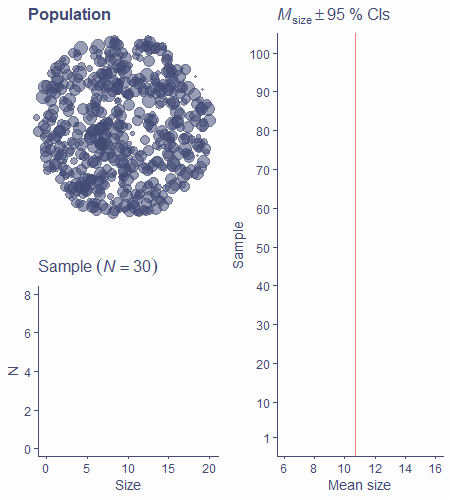
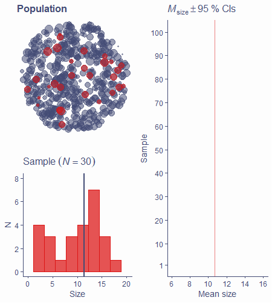
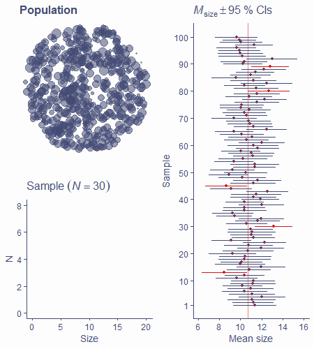
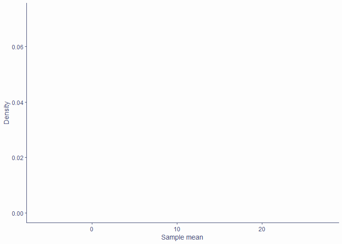
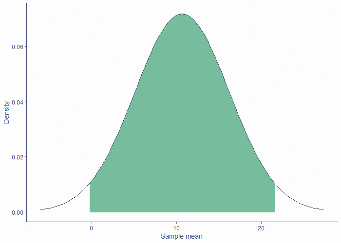
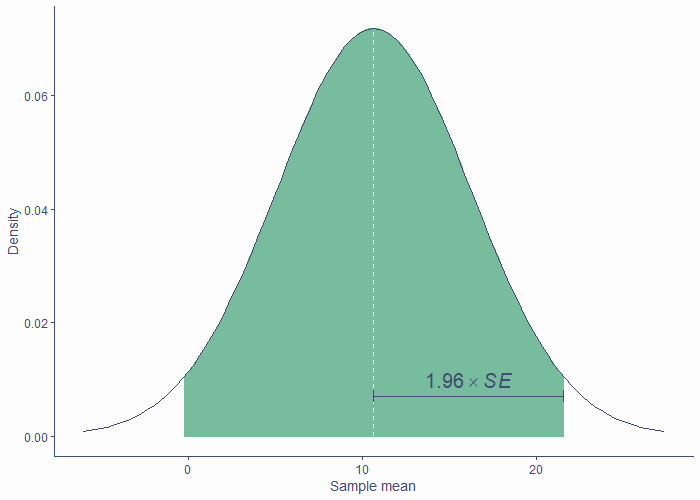
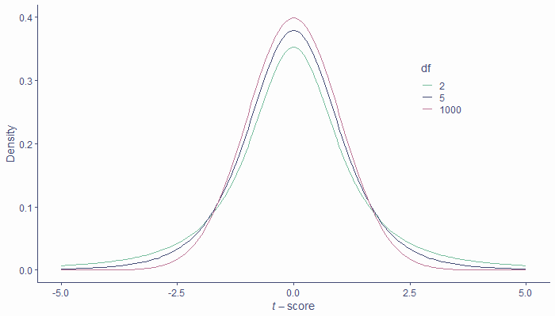
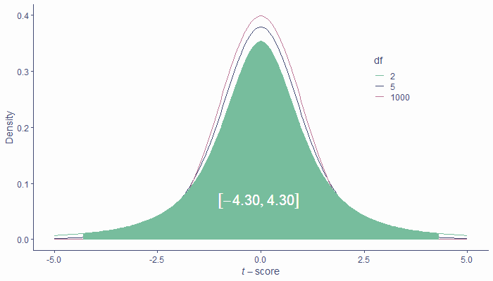

## Before we begin

```{r, echo=F}
set.seed(1234)
library(tidyverse)

### DEFAULT ggplot THEME NOW SET By make.sheet() and Slidify()
# library(colortools)

# bg_col <- "#fdfdfd"
# default_col <- "#434b75"
# theme_col <- "#77bd9d"
# complement_col <- complementary(theme_col, F)[2]
# point_col <- paste0(default_col, "88")

```

Any questions about last week's content?


## Today

- Point estimates vs interval estimates
- Confidence intervals
- *t*-distribution

## What stats is about

- We want to know about the world (population)
- We can only get data from samples
- We calculate statistics on samples and use them to *estimate* the values in population
- Statistics is all about *making inferences about populations based on samples*
- If we could measure the entire population, we wouldn't need stats!


## Point estimates

- You've heard of the sample mean, median, mode
- These are all point estimates - single numbers that are our best guesses about corresponding *population parameters*
- Measures of spread (<i>SD</i>, variance, <i>etc</i>) are also point estimates
- Even relationships between variables can be expressed using point estimates


## Point estimates

\ 

```{r, echo=F, fig.height=5, fig.width=8}
df <- tibble(x = rnorm(100), y1 = rnorm(100), y2 = x + rnorm(100))
r1 <- sub("0\\.", ".", round(cor(df$x, df$y1), 3))
r2 <- sub("0\\.", ".", round(cor(df$x, df$y2), 3))
p1 <- df %>% ggplot(aes(x, y1)) + geom_point(color = theme_col) + labs(title = bquote(italic(r)==.(r1)), x = "X", y = "Y")
p2 <- df %>% ggplot(aes(x, y2)) + geom_point(color = theme_col) + labs(title = bquote(italic(r)==.(r2)), x = "X", y = "") 
plot_grid(p1, p2)
```


### Accuracy and uncertainty

- Sample mean $\bar{x}$ is the best estimate $\hat{\mu}$ of population mean but means of almost all samples differ from population mean $\mu$
- Same is true for *any* point estimate
- *SE* of the mean expresses the uncertainty about the relationship between sample and population means
- *SE* can be calculated for other point estimates, not just the mean
- We can quantify uncertainty around point estimates


## Interval estimates

- In addition to estimating a single value, we can also estimate an interval around it
- <i>e.g.,</i> mean = 4.13 with an interval from &minus;0.2 to 8.46
- Interval estimates communicate the uncertainty around point estimates
- Important -- confidence intervals


## Confidence interval

- We can use *SE* and the sampling distribution to calculate a confidence interval (CI) with a certain *coverage*, <i>e.g.,</i> 90%, 95%, 99%...
- For a 95% CI, 95% of these intervals around sample estimates will contain the value of the population parameter
- Let’s see an example


## Confidence interval

- Population of circles of different sizes

{height="450px"}


## Confidence interval

- Sample from population, estimate mean size

{height="450px"}


## Confidence interval

- Calculate the 95% CI around the mean

{height="450px"}

## Confidence interval

- Lather, rinse, repeat...

{height="450px"}

## Confidence interval

- ~5% don't contain population mean -- 95% coverage

{height="450px"}

### How is it made?

- Easy if we know sampling distribution of the mean
- 95% of sampling distribution is within &plusmn;1.96 <i>SE</i>
- 95% CI around estimated population mean is mean &plusmn;1.96 <i>SE</i>

### How is it made?

- Sampling distribution of the mean is normal (as per [CLT](lec2_slides.html#/the-central-limit-theorem)) 

\ 

{height="400px"}

### How is it made?

- Middle 95% of the sample means lie within &plusmn;1.96 <i>SE</i>

\ 

{height="400px"}

### How is it made?

- We use the same 1.96 <i>SE</i> to construct 95% CI around mean

\ 

{height="400px"}


### How is it made?

- Sampling distribution is, however, not known!
- It can be approximated using the *t*-distribution and *s* and *N*

### <i>t</i>-distribution

- Symmetrical, centred around 0
- Its shape changes based on **degrees of freedom**
- "Fat-tailed" when <i>df</i> = 1; identical to standard normal when <i>df</i> = $\infty$


{height="400px"}

### <i>t</i>-distribution

- As shape changes, so do proportions (unlike with normal)
- In standard normal, middle 95% of data lie within &plusmn;1.96
- In *t*-distribution, this critical value changes based on <i>df</i>

{height="400px"}


### <i>t</i>-distribution

- *t*-distribution pops up in many situations
- Always has to do with **estimating sampling distribution from a finite sample**
- How we calculate number of <i>df</i> changes based on context
  - Often has to do with *N*, number of estimated parameters, or both
  - In the case of sampling distribution of the mean, <i>df = N</i> &minus; 1

### Back to CI

- 95% CI around estimated population mean is mean &plusmn;1.96 <i>SE</i> **if we know the exact shape of sampling distribution**
  - We don't know the shape so we approximate it using the *t*-distribution
- We need to replace the 1.96 with the appropriate critical value for a given number of <i>df</i>
- For <i>N</i> = 30, <i>t</i>~crit~(<i>df</i>=29) = `r round(qt(.975, 29), 2)`

```{r}
qt(p = 0.975, df = 29)
```

### Back to CI

- 95% CI around the mean for a sample of 30 is $\bar{x} \pm 2.05\times SE$
- $\widehat{SE}=\frac{s}{\sqrt{N}}$
- $95\%\ CI = Mean\pm2.05\times \frac{s}{\sqrt{N}}$
- To construct a 95% CI around our estimated mean, all we need is
  - Estimated mean (<i>i.e.</i> sample mean, because $\hat{\mu}=\bar{x}$)
  - Sample *SD* ($s$)
  - *N*
  - Critical value for a *t*-distribution with <i>N</i> &minus; 1 <i>df</i>

### CIs are useful

- Width of the interval tells us about how much we can expect the mean of a different sample of the same size to vary from the one we got
- There's a x% chance that any given x% CI contains the true population mean
- **CAVEAT: **That's not the same as saying that there's a x% chance that the population mean lies within our x% CI!
- CIs can be calculated for *any point estimate*, not just the mean!

#### Remember this?

```{r, echo=F, fig.height=5, fig.width=8} 
plot_grid(p1, p2)
```

#### Remember this?

```{r, echo=F, fig.height=5, fig.width=8}
r1 <- cor.test(df$x, df$y1)
r2 <- cor.test(df$x, df$y2)
r1 <- gsub("0\\.", ".", paste0(round(r1$estimate, 3), "; 95% CI [", paste(round(r1$conf.int, 3), collapse = ", "),"]"))
r2 <- gsub("0\\.", ".", paste0(round(r2$estimate, 3), "; 95% CI [", paste(round(r2$conf.int, 3), collapse = ", "),"]"))
plot_grid(p1 + labs(title = bquote(italic(r)==.(r1))), p2 + labs(title = bquote(italic(r)==.(r2))))
```

    
## Take-home message

- Our aim is to *estimate unknown population characteristics* based on samples
- *Point estimate* is the best guess about a given population characteristic (parameter)
- Estimation is inherently *uncertain*
  - We cannot say with 100% certainty that our estimate is truly equal to the population parameter
  
  
## Take-home message

- *Confidence intervals* express this uncertainty
  - The wider they are, the more uncertainty there is
  - They have arbitrary *coverage* (often 50%, 90%, 95%, 99%)
- CIs are constructed using the *sampling distribution*
  - True sampling distribution is unknown, we can approximate it using the *t*-distribution with given *degrees of freedom*
- CIs can be constructed for *any point estimate*
- For a 95% CI, there is a 95% chance that any given CI contains the true population parameter

#### See you in the practicals :){data-background="pics/end2.jpg" .center .seeyou}
