## Before we begin

```{r, echo=F}
set.seed(1234)
library(tidyverse)
```

Any questions about last week's content?

## Today

- Conceptual, operational & statistical hypothesis
- Null Hypothesis Significance testing
- <i>p</i>-values

## Hypothesis

- Statement about something in the world
    - Often in terms of differences or relationships between things/people/groups
- Must be testable -- it must be possible for the data to either support or disconfirm a hypothesis
- Should be about a single thing

### Levels of hypothesis

- *Conceptual* -- Expressed in normal language on the level of concepts/constructs
- *Operational* -- Restates a conceptual hypothesis in terms of how constructs are measured in a given study
- *Statistical* -- Translates an operational hypothesis into language of mathematics

### Conceptual hypotheses

>- **Good hypothesis:** <i>"The recent observed rising trend in global temperatures on Earth is primarily driven by human-produced greenhouse gas emissions."</i>

\ 

>- **Bad hypothesis:** <i>"Hom&oelig;opathic products can cure people, but sometimes they make them worse before they make them better, and the effect is only apparent subjectively with respect to some vague 'holistic' notions rather than a specific well-defined and testable set of criteria."</i>

### From research question to conceptual hypothesis

- Let's say we're interested in factors predicting [sport climbing](https://en.wikipedia.org/wiki/Sport_climbing){target="_blank"} performance
- *Research question: *Are there morphological characteristics that predispose some people to be better at climbing?
- We have a hunch that having relatively long arms might be beneficial
- *Conceptual hypothesis: *Climbers have relatively longer arms than non-climbers

### Operationalisation

- To be able to formulate a hypothesis in statistical terms, we first need to get from the conceptual level to the level of measurement
- **Operationalisation** is the process of defining variables in terms of how they are measured
    - The *concept* of intelligence can be operationalised as total score on [Raven's Progressive Matrices](https://en.wikipedia.org/wiki/Raven%27s_Progressive_Matrices){target="_blank"}
    - The *concept* of cognitive inhibition can be operationalised as (some measure of) performance on the [Stroop test](https://en.wikipedia.org/wiki/Stroop_effect){target="_blank"}.

#### Ape index

- The [ape index](https://en.wikipedia.org/wiki/Ape_index){target="_blank"} (AI) compares a person's arm span to their height
    - Positive AI means, that your arm span is larger then your height
    - 165 cm (5&#x2032;5&#x2033;) tall person with arm span of 167 cm has an ape index of +2

## \ {data-background="pics/ape.jpg"}

<br><br><br><br><br><br>
&emsp;&emsp;&emsp;&emsp;&emsp;&emsp;&emsp;&emsp;&emsp;&emsp;&emsp;&emsp;&emsp;&emsp;&emsp;&emsp;&emsp;&emsp;&emsp;&emsp;&emsp;&emsp;&emsp;<b>[Ashima Shiraishi](https://www.youtube.com/watch?v=nJhPmvJaz7c){target="_blank"}</b><br>
&emsp;&emsp;&emsp;&emsp;&emsp;&emsp;&emsp;&emsp;&emsp;&emsp;&emsp;&emsp;&emsp;&emsp;&emsp;&emsp;&emsp;&emsp;&emsp;&emsp;&emsp;&emsp;&emsp;155 cm tall<br>
&emsp;&emsp;&emsp;&emsp;&emsp;&emsp;&emsp;&emsp;&emsp;&emsp;&emsp;&emsp;&emsp;&emsp;&emsp;&emsp;&emsp;&emsp;&emsp;&emsp;&emsp;&emsp;&emsp;Ape index +10 cm

### Operational hypotheses

- *Conceptual hypothesis: *Climbers have relatively longer arms than non-climbers

\ 

- *Operational hypothesis: *Elite climbers have, on average, a higher ape index than general population

### Statistical hypotheses

- Translation of operational hypothesis to the language of maths
- Deals with specific values (or ranges of values) of population parameters
  - Mean of a given population can be hypothesised do be of a given value
  - We can hypothesise a difference in means between two populations
  
### Statistical hypothesis

- *Operational hypothesis: *Elite climbers have, on average, a higher ape index than general population

\ 

- *Statistical hypothesis: *$\mu_{AI\_climb} > \mu_{AI\_gen}$

#### Remember

- We are interested in *population parameters*
- However, we cannot measure them
- We can *estimate* them based on *sample statistics*

## Testing hypotheses

- So we measure a climber and a non-climber and compare them to test our hypothesis

>- We find that the climber has a higher AI than the non-climber
>- Hypothesis confirmed; we happy
>- We happy?
>- No, the individuals might not be representative of the populations

### Problem with samples

- We need to collect a larger sample
- However, the principled problem remains -- sample mean might not capture $\mu$ accurately

### Problem with samples

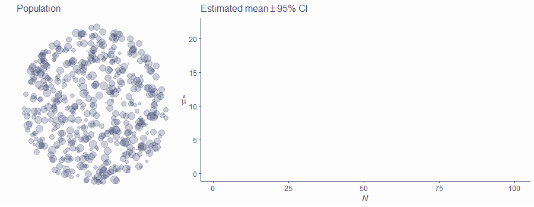{height="400px"}

### Problem with samples

{height="400px"}

### Problem with samples

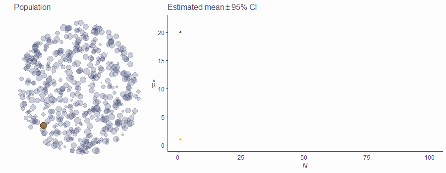{height="400px"}

### The bigger, the better!

- There are statistical fluctuations; they get less important as *N* get bigger
- Means converge to the true value of &mu; as *N* increases
- CIs get exponentially smaller with *N*; statistical power increases
- False positives (and negatives!) happen

### Decisions, decisions

- How do we decide that a difference/effect in our sample actually exists in population?

>- One possible way is using **Null Hypothesis Significance Testing** (NHST)

  >- There is strong criticism of this approach
  >- It is, nonetheless, very widely used
  >- Alternatives exist!
  
## NHST

1. Formulate a research hypothesis (from conceptual to statistical)
2. Formulate the null hypothesis
3. Choose appropriate test statistic
4. Define the probability distribution of the test statistic under the null hypothesis
5. Gather and analyse (*enough*) data -- calculate sample test statistic
6. Get the probability of the value you got under the null hypothesis
7. If the observed value is *likely under the null*, **retain the null**
8. If it is *unlikely under the null*, **reject the null** in favour of research hypothesis, celebrate!


### Hypotheses

- Back to climbers and ape index
- Rather than a directional hypotheses (climbers have longer arms than non-climbers), it's more useful to formulate hypothesis of *some* difference or effect
- *Statistical hypothesis: *$\mu_{AI\_climb} \ne \mu_{AI\_gen}$

### The null hypothesis

- Negation of the statistical hypothesis
- Very often about no difference/effect (but not necessarily)
- *Statistical (alternative) hypothesis: *$H_1:\mu_{AI\_climb} \ne \mu_{AI\_gen}$
- *Null hypothesis: *$H_0:\mu_{AI\_climb} = \mu_{AI\_gen}$

### Test statistic

- Mathematical expressions of what we're measuring
- Many available test statistics, useful for different scenarios
- For now, let's just take simple difference $D = \bar{AI}_{climb}-\bar{AI}_{gen}$
- **If null hypothesis is true**, we'd expect $D=0$, <i>i.e.</i>, no difference between climbers' and non-climbers' AI

### Distribution of test statistic under <i>H</i>~0~

- Even if true difference in population ($\Delta$; delta) is zero $D$ *can be non-zero in sample* (here *N* = 30)
- For simplicity, assume $AI_{gen}$ is normally distributed in population with $\mu = 0$ and $\sigma=1$

### Distribution of test statistic under <i>H</i>~0~

- Even if true difference in population ($\Delta$; delta) is zero $D$ *can be non-zero in sample* (here *N* = 30)
- For simplicity, assume $AI_{gen}$ is normally distributed in population with $\mu = 0$ and $\sigma=1$

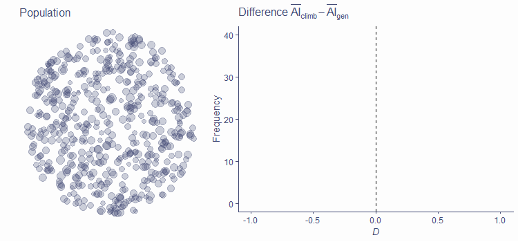{height="350px"}

### Distribution of test statistic under <i>H</i>~0~

- Even if true difference in population ($\Delta$; delta) is zero $D$ *can be non-zero in sample* (here *N* = 30)
- For simplicity, assume $AI_{gen}$ is normally distributed in population with $\mu = 0$ and $\sigma=1$

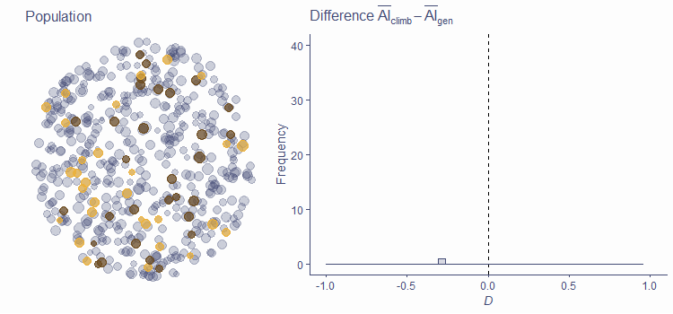{height="350px"}

### Distribution of test statistic under <i>H</i>~0~

- Even if true difference in population ($\Delta$; delta) is zero $D$ *can be non-zero in sample* (here *N* = 30)
- For simplicity, assume $AI_{gen}$ is normally distributed in population with $\mu = 0$ and $\sigma=1$

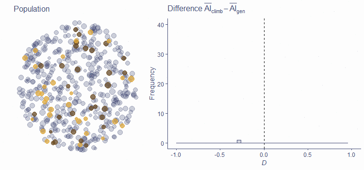{height="350px"}


### Distribution of test statistic under <i>H</i>~0~

- Expected value of <i>D</i> under <i>H</i>~0~ is 0

>- More often than not <i>D</i> will not be equal to 0 in sample
>- Small departures from 0 are common, large ones are rare
>- Distribution of test statistic is dependent on *N*!

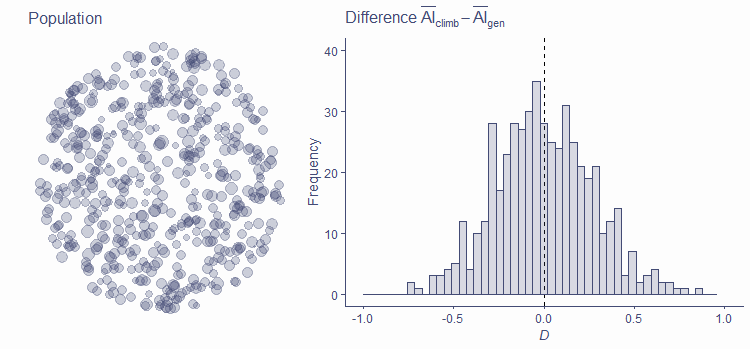{height="350px"}

### Distribution of test statistic under alternative hypothesis

- <i>H</i>~1~ is true, test statistics is not centred around zero
- Sometimes, a null result can still be observed (false negative; Type II error)


### Distribution of test statistic under alternative hypothesis

- <i>H</i>~1~ is true, test statistics is not centred around zero
- Sometimes, a null result can still be observed (false negative; Type II error)

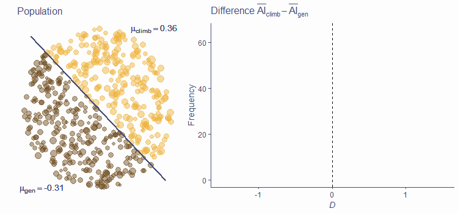{height="350px"}


### Distribution of test statistic under alternative hypothesis

- <i>H</i>~1~ is true, test statistics is not centred around zero
- Sometimes, a null result can still be observed (false negative; Type II error)

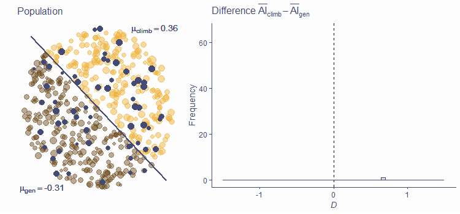{height="350px"}


### Distribution of test statistic under alternative hypothesis

- <i>H</i>~1~ is true, test statistics is not centred around zero
- Sometimes, a null result can still be observed (false negative; Type II error)

{height="350px"}


### Probability of test statistic under <i>H</i>~0~

- Once we know what the distribution of our test statistic is, we can assess the probability of getting any given observed value *or a more extreme value* of <i>D</i>

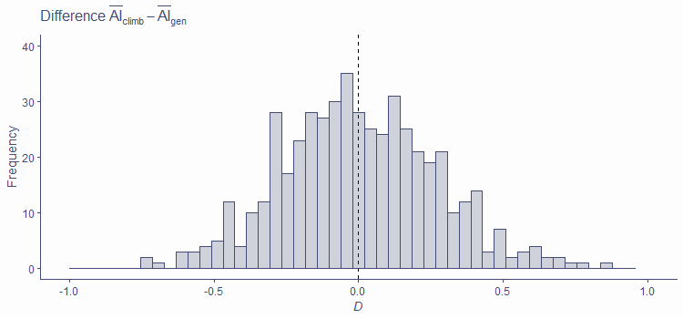{height="400px"}

### Probability of test statistic under <i>H</i>~0~

- Once we know what the distribution of our test statistic is, we can assess the probability of getting any given observed value *or a more extreme value* of <i>D</i>

{height="400px"}

### Probability of test statistic under <i>H</i>~0~

- Once we know what the distribution of our test statistic is, we can assess the probability of getting any given observed value *or a more extreme value* of <i>D</i>

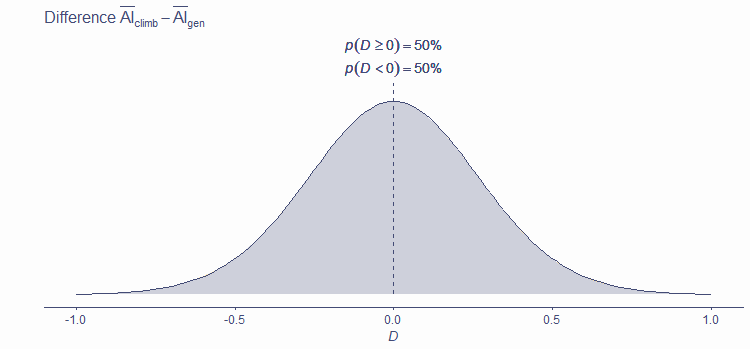{height="400px"}

### Gather data and calculate the test statistic

- Say we collected AI measurements from 30 climbers and 30 non-climbers
- We calculated the mean difference, *D* = 0.47

### Calculate probability of observed statistic under <i>H</i>~0~

\ 

\ 

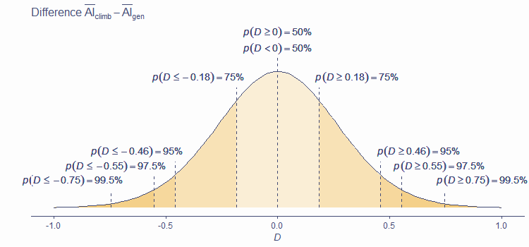{height="400px"}

### The <i>p</i>-value

The *p*-value is the probability of getting a test statistic *at least as extreme* as the one observed *if the null hypothesis is really true*

>- Tells us how likely our data are *if there is no difference/effect in population*
>- **Does not** tell us the probability of <i>H</i>~0~ or <i>H</i>~1~ being true
>- **Does not** tell us the probability of our data happening "by chance alone"

### Decision

- So we have
  - Data
  - Test statistic
  - Distribution of test statistic
  - *p*(test_stat) under <i>H</i>~0~

>- What now?

### Decision

- We *reject* <i>H</i>~0~ and *accept* <i>H</i>~1~ if we judge our result to be unlikely under <i>H</i>~0~

\ 

- We *retain* <i>H</i>~0~ if we judge the result to be likely under it

## How likely is likely enough?

- This is an **arbitrary** choice!
- Commonly used *significance levels* are
  - 5% (.05; most common)
  - 1% (.01)
  - 0.1% (.001)
- If *p*-value is less than our chosen significance level, we call the result *statistically significant* (sufficiently unlikely under <i>H~0~</i>)
- **Significance level must be chosen before results are analysed!**

## What about the ape index?

>- We found a mean difference in AI between climbers and non-climbers of 0.47
>- This statistic has an associated *p*-value = .093
>- Under the most common significance level in psychology (.05), this is **not a statistically significant** difference
>- We thus *retain* the null hypothesis and report not having found a difference -- our hypothesis was not supported by the data

## Take-home message

- **Hypotheses** should be clearly formulated, *testable*, and *operationalised*
- **Statistical hypotheses** are statements about values of some parameters 
- **Null hypothesis** (usually, parameter is equal to 0) is the one we test (in NHST framework)
- We can only observe *samples*, but we are interested in *populations*
- Due to sampling error, we can find a relationship in sample even if one doesn't exist in population
- **NHST** is one way of deciding if sample result holds in population -- understanding it is crucial!

#### See you in the practicals :){data-background="pics/end2.jpg" .center .seeyou}

