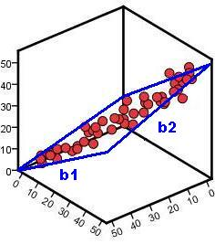

## Overview 

```{r setup, include=FALSE, message=F, warning=FALSE}
knitr::opts_chunk$set(echo = FALSE, message = F, warning = F)
library(MASS)
library(tidyverse)
library(cowplot)
library(lm.beta)
library(broom)
# library(kableExtra)
# library(gridExtra)
library(weights)
# library(adata)
#colour = #03a7a7

to_math <- function(x) {
  gsub(" ", "\\\\ ", x)
}
```

```{r eg1a_setup}
set.seed(42)
myN <- 20

choc.b0 <- 0.7
choc.b1 <- 0.9
#choc.b2 <- 1.37
choc.sigma <- 0.7

liking <- runif(myN, 0, 5)
lactose <- runif(myN, 0, 3)

eps <- rnorm(liking, 0, choc.sigma) 
choc = choc.b0 + choc.b1*liking + eps

choc.tib <- tibble(choc, liking, lactose)
choc.lm <- lm(choc ~ liking)
#choc.lm %>% summary()

choc.sum <- choc.tib %>% 
  summarise_at(c(1:2), .funs = c(mean = "mean", sd = "sd", max = "max", min = "min"))

choc.tib$predicted <- predict(choc.lm)
choc.tib$residuals <- residuals(choc.lm)
choc.tib$overallmean <- choc.sum$choc_mean
choc.ylim <- choc.sum$choc_max + 0.5
liking.xlim <- choc.sum$liking_max + 0.5

choc2.lm <- lm(overallmean ~ liking, choc.tib)
choc.tib$predicted2 <- predict(choc2.lm)
choc.tib$residuals2 <- residuals(choc2.lm)
```

```{r eg1b_setup}
set.seed(42)
myN <- 20

cabbage.b0 <- 0.7
cabbage.b1 <- 0.01
#cabbage.b2 <- 1.37
cabbage.sigma <- 0.7

liking <- runif(myN, 0, 5)
lactose <- rnorm(myN, 0, 3)

eps <- rnorm(liking, 0, cabbage.sigma)
cabbage = cabbage.b0 + cabbage.b1*liking + eps

cabbage.tib <- tibble(cabbage, liking)
cabbage.lm <- lm(cabbage ~ liking)
#cabbage.lm %>% summary()

cabbage.sum <- cabbage.tib %>% 
  summarise_at(c(1:2), .funs = c(mean = "mean", sd = "sd", max = "max", min = "min"))

cabbage.tib$predicted <- predict(cabbage.lm)
cabbage.tib$residuals <- residuals(cabbage.lm)
cabbage.tib$overallmean <- cabbage.sum$cabbage_mean
cabbage.ylim <- cabbage.sum$cabbage_max + 0.5
liking.xlim <- cabbage.sum$liking_max + 0.5

cabbage2.lm <- lm(overallmean ~ liking, cabbage.tib)
cabbage.tib$predicted2 <- predict(cabbage2.lm)
cabbage.tib$residuals2 <- residuals(cabbage2.lm)

#cabbage.lm %>% summary()
#cabbage.sum$cabbage_mean

scatter.cabbage.ssm <- cabbage.tib %>% 
  ggplot(aes(x = liking, y = cabbage)) +
  geom_point(alpha = .3, size = 2.5) +
  #xlim(0, 5) + ylim(0, 11) +
  labs(y = "Chocolate (n per week)", x = "Cabbage liking (1-10)") +
  stat_smooth(method =lm, fullrange = T, se = F) +
  # theme_cowplot()+
  #geom_segment(aes(xend = predicted2, yend = predicted)) +
  geom_hline(yintercept=cabbage.sum$cabbage_mean, linetype="dashed", color = "red") #+
#geom_point(aes(y = predicted), shape = 1) 
```

```{r eg1ab_plots}
meanmod.choc <- choc.tib %>% 
ggplot(aes(x = liking, y = choc)) +
# geom_point(alpha = .3, size = 2.5) +
ylim(0, choc.ylim) +
labs(y = "Chocolate (n per week)", x = "") +
# stat_smooth(method =lm, fullrange = T, se = F) +
geom_hline(yintercept=choc.sum$choc_mean, linetype="dashed", color = "red")
# theme_cowplot()
#geom_point(aes(y = predicted), shape = 1) 

scatter.choc <- choc.tib %>% 
  ggplot(aes(x = liking, y = choc)) +
  geom_point(alpha = .3, size = 2.5) +
  # xlim(0, liking.xlim) + ylim(0, choc.ylim) +
  #  ylim(0, choc.ylim) +
  labs(y = "Chocolate (n per week)", x = "Chocolate liking (1-10)") +
  #stat_smooth(method =lm, fullrange = T, se = F) +
  geom_hline(yintercept=choc.sum$choc_mean, linetype="dashed", color = "red")
  # theme_cowplot()
# geom_point(aes(y = predicted), shape = 1) 

scatter.choc.lm <- choc.tib %>% 
  ggplot(aes(x = liking, y = choc)) +
  geom_point(alpha = .3, size = 2.5) +
  xlim(0, liking.xlim) + ylim(0, choc.ylim) +
  labs(y = "Chocolate (n per week)", x = "Chocolate liking (1-10)") +
  stat_smooth(method =lm, fullrange = T, se = F) 
  # theme_cowplot()
#geom_segment(aes(xend = liking, yend = predicted2)) +
#geom_hline(yintercept=choc.sum$choc_mean, linetype="dashed", color = "red") +
#geom_point(aes(y = predicted2), shape = 1) 

scatter.choc.sst <- choc.tib %>% 
  ggplot(aes(x = liking, y = choc)) +
  geom_point(alpha = .3, size = 2.5) +
  # xlim(0, liking.xlim) + ylim(0, choc.ylim) +
  labs(y = "Chocolate (n per week)", x = "Chocolate liking (1-10)") +
  #stat_smooth(method =lm, fullrange = T, se = F) +
  # theme_cowplot()+
  geom_segment(aes(xend = liking, yend = predicted2)) +
  geom_hline(yintercept=choc.sum$choc_mean, linetype="dashed", color = "red") +
  geom_point(aes(y = predicted2), shape = 1) 

scatter.choc.ssr <- choc.tib %>% 
  ggplot(aes(x = liking, y = choc)) +
  geom_point(alpha = .3, size = 2.5) +
  #xlim(0, liking.xlim) + ylim(0, choc.ylim) +
  labs(y = "Chocolate (n per week)", x = "Chocolate liking (1-10)") +
  stat_smooth(method =lm, fullrange = T, se = F) +
  #geom_hline(yintercept=choc.sum$choc_mean, linetype="dashed", color = "red") +
  # theme_cowplot()+
  geom_segment(aes(xend = liking, yend = predicted)) +
  geom_point(aes(y = predicted), shape = 21, colour = "black", fill = "red",  size = 2) 

scatter.choc.ssm <- choc.tib %>% 
  ggplot(aes(x = liking, y = choc)) +
  geom_point(alpha = .3, size = 2.5) +
  #xlim(0, 5) + ylim(0, 11) +
  labs(y = "Chocolate (n per week)", x = "Chocolate liking (1-10)") +
  stat_smooth(method =lm, fullrange = T, se = F) +
  # theme_cowplot()+
  #geom_segment(aes(xend = predicted2, yend = predicted)) +
  geom_hline(yintercept=choc.sum$choc_mean, linetype="dashed", color = "red") #+
#geom_point(aes(y = predicted), shape = 1) 

```

```{r eg2_setup}
eg2.outcome = "bullshit receptivity"
eg2.pred1 = "paranormal beliefs"
eg2.pred2 = "complementary & alternative medicine beliefs"
eg2.pred2.short = "alternative medicine"
eg2.pred2.med = "alternative medicine beliefs"

set.seed(150385)
myN = 800
myM <- c(2.6, 5, 8)
myCov <- matrix(c(1, .3, .24,
                  .3, 1, .58, 
                  .24, .58, 1 ), ncol=3)
bullshit <- data.frame(mvrnorm(n = myN, mu=myM, Sigma=myCov, empirical=TRUE))
names(bullshit)[1:3] <- c("BSR", "PB", "CAM")

bullshit.model <- lm(BSR ~ PB + CAM, data = bullshit, na.action = na.exclude) #rep
bullshit.out <- summary(bullshit.model) #rep

eg2.r2 <- bullshit.out$r.squared %>% round(3)
eg2.adjr2 <- bullshit.out$adj.r.squared %>% round(3)

```

```{r eg3_setup}
eg3.outcome = "impulse control" 
eg3.pred1 = "bladder fullness"
eg3.pred2 = "inhibition"

set.seed(42)
myN <- 20

eg3.b0 <- 0.7
eg3.b1 <- 0.9
eg3.b2 <- 1.37
eg3.sigma <- 0.7

bladder <- rnorm(myN, 3, 2)
inhibition <- rnorm(myN, 4.5, 1.8)
eps <- rnorm(inhibition, 0, eg3.sigma) 
impulse = eg3.b0 + eg3.b1*bladder + eg3.b2*inhibition + eps
eg3.data.tib <- tibble(impulse, bladder, inhibition)

eg3.mod1.lm <- lm(impulse ~ bladder)
eg3.mod2.lm <- lm(impulse ~ bladder + inhibition)
eg3.mod1.fit <- broom::glance(eg3.mod1.lm)
eg3.mod2.fit <- broom::glance(eg3.mod2.lm)
eg4.anova <- anova(eg3.mod1.lm,eg3.mod2.lm) %>% broom::tidy()
eg3.mod2.stdbeta <- lm.beta::lm.beta(eg3.mod2.lm)

eg3.sum <- eg3.data.tib %>% 
  summarise_at(c(1:3), .funs = c(mean = "mean", sd = "sd", max = "max", min = "min"))


eg3.mod2.out <- broom::tidy(eg3.mod2.lm, conf.int = TRUE)
eg3.mod2.pred1.p <- eg3.mod2.out$p.value[2]
eg3.mod2.pred2.p <- eg3.mod2.out$p.value[3] 
eg3.mod2.pred1.beta <- eg3.mod2.out$estimate[2]
eg3.mod2.pred2.beta <- eg3.mod2.out$estimate[3] 
eg3.mod2.beta.largest.name <- if_else(eg3.mod2.pred1.beta > eg3.mod2.pred2.beta, eg3.pred1, eg3.pred2)
eg3.mod2.beta.smallest.name <- if_else(eg3.mod2.pred1.beta > eg3.mod2.pred2.beta, eg3.pred2, eg3.pred1)

eg3.mod2.pred1.stdbeta <- eg3.mod2.stdbeta$standardized.coefficients[2]
eg3.mod2.pred2.stdbeta <- eg3.mod2.stdbeta$standardized.coefficients[3] 
eg3.mod2.stdbeta.largest.name <- if_else(eg3.mod2.pred1.stdbeta > eg3.mod2.pred2.stdbeta, eg3.pred1, eg3.pred2)
eg3.mod2.stdbeta.smallest.name <- if_else(eg3.mod2.pred1.stdbeta > eg3.mod2.pred2.stdbeta, eg3.pred2, eg3.pred1)


```

```{r eg4_setup}
eg4.outcome = "happiness" #????
eg4.pred1 = "puppies"
eg4.pred2 = "dirt"
eg4.pred3 = "wet"
#eg4.pred2.short = "alternative medicine"
#eg4.pred2.med = "alternative medicine beliefs"

set.seed(42)
myN <- 20

eg4.b0 <- 4
eg4.b1 <- 1
eg4.b2 <- -.2
eg4.b3 <- -.9
eg4.sigma <- 0.7

puppies <- rnorm(myN, 3, 2)
dirt <- rnorm(myN, 4.5, 1.8)
wet <- rnorm(myN, 4.5, 1.8)
eps <- rnorm(puppies, 0, eg4.sigma) 
happiness = eg4.b0 + eg4.b1*puppies + eg4.b2*dirt + eg4.b3*wet + eps

eg4.data.tib <- tibble(happiness, puppies, dirt, wet)
eg4.mod1.lm <- lm(happiness ~ puppies, data = eg4.data.tib)
eg4.mod2.lm <- lm(happiness ~ puppies + dirt + wet, data = eg4.data.tib)
#eg4.mod1.lm %>% summary()
#eg4.mod2.lm %>% summary()

eg4.sum <- eg4.data.tib %>% 
  summarise_at(c(1:3), .funs = c(mean = "mean", sd = "sd", max = "max", min = "min"))

eg4.mod2.stdbeta <- lm.beta::lm.beta(eg4.mod2.lm)
eg4.mod2.out <- broom::tidy(eg4.mod2.lm, conf.int = TRUE)
eg4.mod1.fit <-broom::glance(eg4.mod1.lm)
eg4.mod2.fit <-broom::glance(eg4.mod2.lm)
eg4.mod2.pred1.p <-  eg4.mod2.out$p.value[2]
eg4.mod2.pred2.p <-  eg4.mod2.out$p.value[3] 
eg4.mod2.pred3.p <-  eg4.mod2.out$p.value[4]
eg4.mod2.pred1.beta <-  eg4.mod2.out$estimate[2]
eg4.mod2.pred2.beta <-  eg4.mod2.out$estimate[3]
eg4.mod2.pred3.beta <-  eg4.mod2.out$estimate[4]
eg4.mod2.pred1.stdbeta <-  eg4.mod2.stdbeta$standardized.coefficients[2]
eg4.mod2.pred2.stdbeta <-  eg4.mod2.stdbeta$standardized.coefficients[3] 
eg4.mod2.pred3.stdbeta <-  eg4.mod2.stdbeta$standardized.coefficients[4] 

eg4.mod2.beta.largest.name <- ifelse(
  eg4.mod2.pred1.beta > eg4.mod2.pred2.beta & eg4.mod2.pred1.beta > eg4.mod2.pred3.beta, eg4.pred1,
  ifelse(eg4.mod2.pred2.beta > eg4.mod2.pred3.beta, eg4.pred2, 
         eg4.pred3))

eg4.mod2.beta.smallest.name <- ifelse(
  eg4.mod2.pred1.beta < eg4.mod2.pred2.beta & eg4.mod2.pred1.beta < eg4.mod2.pred3.beta, eg4.pred1,
  ifelse(eg4.mod2.pred2.beta < eg4.mod2.pred3.beta, eg4.pred2, 
         eg4.pred3))

eg4.mod2.stdbeta.largest.name <- ifelse(
  eg4.mod2.pred1.stdbeta > eg4.mod2.pred2.stdbeta & eg4.mod2.pred1.stdbeta > eg4.mod2.pred3.stdbeta, eg4.pred1,
  ifelse(eg4.mod2.pred2.stdbeta > eg4.mod2.pred3.stdbeta, eg4.pred2, 
         eg4.pred3))

eg4.mod2.stdbeta.smallest.name <- ifelse(
  eg4.mod2.pred1.stdbeta < eg4.mod2.pred2.stdbeta & eg4.mod2.pred1.stdbeta < eg4.mod2.pred3.stdbeta, eg4.pred1,
  ifelse(eg4.mod2.pred2.stdbeta < eg4.mod2.pred3.stdbeta, eg4.pred2, 
         eg4.pred3))

eg4.mod2.stdbeta.largest <- ifelse(
  eg4.mod2.pred1.stdbeta > eg4.mod2.pred2.stdbeta & eg4.mod2.pred1.stdbeta > eg4.mod2.pred3.stdbeta, eg4.mod2.pred1.stdbeta,
  ifelse(eg4.mod2.pred2.stdbeta > eg4.mod2.pred3.stdbeta, eg4.mod2.pred2.stdbeta, 
         eg4.mod2.pred3.stdbeta))

eg4.mod2.stdbeta.smallest <- ifelse(
  eg4.mod2.pred1.stdbeta < eg4.mod2.pred2.stdbeta & eg4.mod2.pred1.stdbeta < eg4.mod2.pred3.stdbeta, eg4.mod2.pred1.stdbeta,
  ifelse(eg4.mod2.pred2.stdbeta < eg4.mod2.pred3.stdbeta, eg4.mod2.pred2.stdbeta, 
         eg4.mod2.pred3.stdbeta))
```

```{r predVobs_setup}
pred_v_obs.scatter <- choc.tib %>% 
  ggplot(aes(x = liking, y = choc)) +
  geom_point(alpha = .3, size = 2.5) +
  # xlim(0, liking.xlim) + ylim(0, choc.ylim) +
  ylim(0, 6) +
  labs(y = "Outcome variable", x = "Predictor variable")
  #stat_smooth(method =lm, fullrange = T, se = F) +
  #geom_hline(yintercept=choc.sum$choc_mean, linetype="dashed", color = "red") +
  # theme_cowplot() 
  #geom_point(aes(y = predicted), shape = 1)
pred_v_obs.pred <- choc.tib %>% 
  ggplot(aes(x = liking, y = choc)) +
  geom_point(alpha = .3, size = 2.5) +
  # xlim(0, liking.xlim) + ylim(0, choc.ylim) +
  ylim(0, 6) +
  labs(y = "Outcome variable", x = "Predictor variable") +
  #stat_smooth(method =lm, fullrange = T, se = F) +
  #geom_hline(yintercept=choc.sum$choc_mean, linetype="dashed", color = "red") +
  # theme_cowplot() +
  geom_point(aes(y = predicted), shape = 21, colour = "black", fill = "red", size = 2.5) 
pred_v_obs.predlm <- choc.tib %>% 
  ggplot(aes(x = liking, y = choc)) +
  geom_point(alpha = .3, size = 2.5) +
  # xlim(0, liking.xlim) + ylim(0, choc.ylim) +
  ylim(0, 6) +
  labs(y = "Outcome variable", x = "Predictor variable") +
  stat_smooth(method =lm, fullrange = T, se = F) +
  #geom_hline(yintercept=choc.sum$choc_mean, linetype="dashed", color = "red") +
  # theme_cowplot() +
  geom_point(aes(y = predicted), shape = 21, colour = "black", fill = "red", size = 2.5) 
pred_v_obs.ssr <- choc.tib %>% 
  ggplot(aes(x = liking, y = choc)) +
  geom_point(alpha = .3, size = 2.5) +
  # xlim(0, liking.xlim) + ylim(0, choc.ylim) +
  ylim(0, 6) +
  labs(y = "Outcome variable", x = "Predictor variable") +
  stat_smooth(method =lm, fullrange = T, se = F) +
  #geom_hline(yintercept=choc.sum$choc_mean, linetype="dashed", color = "red") +
  # theme_cowplot() +
  geom_segment(aes(xend = liking, yend = predicted)) +
  geom_point(aes(y = predicted), shape = 21, colour = "black", fill = "red", size = 2.5) 
```

```{r regline_plane_setup}
regline1 <- choc.tib %>% 
  ggplot(aes(x = liking, y = choc)) +
  geom_point(alpha = .3, size = 2.5) +
  ylim(0, 6) +
  labs(y = "Outcome variable", x = "Predictor variable 1") +
  stat_smooth(method =lm, fullrange = T, se = F)
  # theme_cowplot() 
regline2 <- choc.tib %>% 
  ggplot(aes(x = lactose, y = choc)) +
  geom_point(alpha = .3, size = 2.5) +
  ylim(0, 6) +
  labs(y = "Outcome variable", x = "Predictor variable 2") +
  stat_smooth(method =lm, fullrange = T, se = F)
  # theme_cowplot()
```

```{r JM_report.p, include = F}
report.p <- function(x){
  ifelse(x > .001, paste0(" = ", weights::rd(x, 3)), "< .001")
}
```

## Overview 

- Week 8: The Linear Model
- TODAY: The Linear Model with multiple predictors
- [3 weeks for Spring vacation]
- Week 10: Effect sizes
- Week 11: Consolidation


## RECAP

- Trying to make predictions about the world using linear models
- Fit a line to capture the relationship between predictor & outcome
- Linear model (line) is described by an intercept (*b*~0~) and a slope (*b*~1~)

$$Outcome = b_0 + b_1\times Predictor_1 + \varepsilon$$


- The outcome 'starts' at *b*~0~
- The outcome will increase by *b*~1~ for every unit change in predictor 1
- Always some error in model
- Use the model to see: 
    - *R*^2^: proportion of variance in outcome that model explains
    - *t*-statistic and associated *p*-value: is *b*~1~ different from 0?
    - Direction of relationship between predictor/outcome (positive/negative)

## Today's Topics

- How good *is* our model? 
    - Our model vs the mean
    - Error in the model
- Throwing more predictors into the mix
- Comparing hierarchical models
- Comparing predictors in a model
- Bringing it all together: what can our model tell us?

## How good *is* our model?

- How do we tell?
- *R*^2^: what (proportion of variance) can our model explain
- How much better is our model than the simplest model possible?
- How much error in prediction is there in our model?

### Keep is simple, stupid: The mean model

{width=400px}


- We want a linear model that explains more than the simplest model possible
- The simplest model we can use is the mean...
- Mean chocolate bars eaten per week is `r choc.sum$choc_mean %>% round(2)`  
- Predict how much chocolate your neighbour eats a week... you'd predict `r choc.sum$choc_mean %>% round(2)` bars!

### Keep is simple, stupid: The mean model

- Let's plot this
    - Chocolate eaten is our outcome variable, predicted from the mean: `r choc.sum$choc_mean %>% round(2)`
    - Not a great model!
    
```{r F_vis_meanmod1}
meanmod.choc + 
  labs(y = "Chocolate (n per week)", x = "Chocolate liking (1-10)") 
```

### Keep is simple, stupid: The mean model

- Let's add a predictor
    - Liking along x axis
    - Error between prediction (using mean) and observed data (actual
scores) 

```{r F_vis_meanmod2}
meanmod.choc +  
  geom_point(alpha = .3, size = 2.5) + 
  labs(y = "Chocolate (n per week)", x = "Chocolate liking (1-10)") 
  
```

### Keep is simple, stupid: The mean model

- Let's add a predictor
    - Liking along x axis
    - Error between prediction (using mean) and observed data (actual
scores) 

```{r F_vis_meanmod3}
meanmod.choc + geom_point(alpha = .3, size = 2.5) +
  labs(y = "Chocolate (n per week)", x = "Chocolate liking (1-10)") +
  geom_segment(aes(xend = liking, yend = predicted2)) +
  geom_point(aes(y = predicted2), shape = 1) 
```


### We can do better, probably...

- Let's construct a linear model between chocolate liking and eating
    - The line that explains our data with as little error as possible
    - Compare that to the line representing our mean model
    - Very different!

```{r F_vis_reg_ssm1}
scatter.choc.lm
```

### We can do better, probably...

- Let's construct a linear model between chocolate liking and eating
    - The line that explains our data with as little error as possible
    - Compare that to the line representing our mean model
    - Very different!

```{r F_vis_reg_ssm2}
scatter.choc.lm + 
  geom_hline(yintercept=choc.sum$choc_mean, linetype="dashed", color = "red") 
```

- Shows the **improvement in prediction** of the outcome from fitting a linear model
- A larger difference = a greater improvement!
- We want a linear model that explains more than the simplest model - the mean model

```{r F_vis_ssm_size_compare, fig.width=8}
plot_grid(scatter.choc.ssm, scatter.cabbage.ssm)
```


## Interim summary

- Is our linear model is better than the simplest model possible?
    - The mean model is the simplest model we can fit to our data     
    - We want a linear model that predicts the outcome better than the mean model
    - Difference between linear model & mean model = improvement
- A linear model better than the mean still contains error in prediction
- But...how much error is still in the model?
    - Does the model explain more than it doesn't explain?
    - How well does the linear model predict the outcome

## Error in the model

- We now know whether the linear model we fitted is better than the mean model
    - But there will still be error in the model
- Fit a line to **best** capture the relationship between predictors and outcome 
- In the real world, no model will fit the data perfectly
    - Want the **least error** possible between the predicted and observed points


## Error in the model

- Let's look at how much error our linear model contains

\ 

<section>


</section>

 

### Bringing it all together: the *F*-statistic

- Conceptually, we now have what we need for the *F*-statistic:

$$F =\frac{what\ the model\ can\ explain\ (compared\ to\ the\ worst\ model)}{what\ the\ model\ cannot\ explain\ (error\ left\ in\ model)}=\frac{signal}{noise}$$

- Signal = the improvement in variance explained by the model (vs the mean-model)
    - How much variance the model explains
    - We want this to be as big as possible
- Noise = the varience unexplained by the model
    - The error our model cannot explain
    - We want this to be as small as possible
    
### Bringing it all together: the *F*-statistic

- A **ratio** of **variance explained** relative to **varience unexplained**
- If the ratio > 1, our model can explain more than it cannot explain
- The associated *p*-value tells us the probability of getting an *F*-statistic at least that large if fitting our model *did not* improve our ability to predict the outcome variable


## Why you gotta complicate things?

{width=400px}

\ 

- First, multiple predictors are not much more complicated!
  - We build models to try and predict what is happening in the world
- Simple explainations for complex relationships?  
- Multiple predictors = greater explanatory power 
  
## How multiple predictors (don't really) change the equation 

$$\begin{aligned}Outcome &= Model + Error\\
Y&=b+0 + b_1\times Predictor_1 + \varepsilon\\
&=b+0 + b_1\times Predictor_1 + b_2\times Predictor_2 + \varepsilon\end{aligned}$$

  
- Y: outcome  
- *b*~0~: value of outcome when predictors are 0 (the intercept)  
- *b*~1~: change in outcome associated with a unit change in predictor 1
- *b*~2~: change in outcome associated with a unit change in predictor 2 

## How multiple predictors (don't really) change the linear model equation

- 1 predictor linear model = regression line
- 2+ predictor model = regression plane

{width=200px}


## Predicting "bullshit receptivity"

{width=400px}

> "Attention and intention are the mechanics of manifestation"<br>
"Hidden meaning transforms unparalleled abstract beauty"<br>
"Unparalleled transforms meaning beauty hidden abstract" ~Deepak Chopra

## Predicting "bullshit receptivity" 

$$\begin{aligned}`r to_math(eg2.outcome)`\ = &\ b_0 + b_1\times `r to_math(eg2.pred1)`\ +\\ &\ b_2\times `r to_math(eg2.pred2.short)` + \varepsilon\end{aligned}$$

- Y: `r eg2.outcome`  
- *b*~0~: value of `r eg2.outcome`when `r eg2.pred1` and `r eg2.pred2.short` are 0 (the intercept)  
- *b*~1~: change in `r eg2.outcome` associated with a unit change in `r eg2.pred1` when `r eg2.pred2.med` is 0
- *b*~2~: change in `r eg2.outcome` associated with a unit change in `r eg2.pred2.med` when `r eg2.pred1` is 0

## Predicting "bullshit receptivity"

              
```{r bullshit_lm, echo = T}
bullshit.model <- lm(BSR ~ PB + CAM, data = bullshit, na.action = na.exclude)
broom::glance(bullshit.model)
```

```{r}
bullshit.out <- broom::glance(bullshit.model)
```


- The *F*-statistic is `r bullshit.out$statistic %>% round(2)`
- The associated p-value is `r bullshit.out$p.value %>% report.p`
    - This means that adding predictors to the mean model significantly improved the fit of our model
    - We were able to explain significantly more variance in our outcome than we were not able to explain

## Predicting "bullshit receptivity"

```{r bullshit_lm2, echo = T}
bullshit.model <- lm(BSR ~ PB + CAM, data = bullshit, na.action = na.exclude)
broom::glance(bullshit.model)
```

- The *R*^2^ is `r bullshit.out$r.squared %>% round(2)` 
    - This means `r bullshit.out$r.squared %>% round(2) * 100`% of the variance in bullshit receptivity ratings was explained by paranormal belief **and** complementary and alternative medicine belief ratings
    
- This is just in our observed data!
- Our adjusted *R*^2^ value was `r bullshit.out$adj.r.squared %>% round(3)`
    - If we used the same model with the population, we should be able to explain `r eg2.adjr2*100`% of the variance in bullshit receptivity


## Interim summary, mark II 

- The linear model can be expanded to include additional predictors
- The model is still described by an intercept (*b*~0~) but now includes slopes (*b*s) for each predictor
- This creates a regression plane instead of a line
- We can assess how good this model is 
    - *F*-ratio and associated *p*-value
    - *R*^2^
- What if we want to compare two models, to see which better explains varience in our outcome?
    
## Comparing hierarchical models

- We can compare models with different numbers of predictors
    - See which model better captures our outcome
- We looked at how we can compare a simple model (the mean) and  a more complex model (the linear model)
    - Can also compare simpler linear models and more complex linear models
    - But the models must be 'hierarchical'
        - 2^nd^ model has the same predictors as the 1^st^ model plus extra
        - 3^rd^ model has the same predictors as the 2^nd^ model plus extra

## Predicting impulse control from bladder fullness

{height=200px}

Model 1:

$$`r to_math(eg3.outcome)` = b_0 + b_1\times `r to_math(eg3.pred1)` + \varepsilon$$

\ 

Model 2:

$$`r to_math(eg3.outcome)` = b_0 + b_1\times `r to_math(eg3.pred1)` + b_2\times `r to_math(eg3.pred2)` + \varepsilon$$  

## Predicting impulse control from bladder fullness

- Y: `r eg3.outcome`  
- *b*~0~: value of `r eg3.outcome` when `r eg3.pred1` and `r eg3.pred2` are 0 (the intercept)  
- *b*~1~: change in `r eg3.outcome` associated with a unit change in `r eg3.pred1` when `r eg3.pred2` is 0
- *b*~2~: change in `r eg3.outcome` associated with a unit change in `r eg3.pred2` when `r eg3.pred1` is 0

## Predicting impulse control from bladder fullness

```{r eg3_lm, echo = T}
eg3.mod1.lm <- lm(impulse ~ bladder, data = eg3.data.tib)
eg3.mod2.lm <- lm(impulse ~ bladder + inhibition, data = eg3.data.tib)
```

- First, which is the **better** model?
- Second, **how useful** is the best model?

## With great (predictive) power comes great responsibility

- Need to assess which is the best model
- Want to *compare* Model 1 (1 predictor) and Model 2 (2 predictors)
    - See the amount of improvement from adding extra predictors into the model
    - Look at ***R*^2^-change** and ***F*-change**
  

## With great (predictive) power comes great responsibility

{width=400px}


### R^2^-change

Model 1:

```{r eg3_fit.m1, echo = T}
broom::glance(eg3.mod1.lm)
```

\ 

Model 2:

```{r eg3_fit.m2, echo = T}
broom::glance(eg3.mod2.lm)
```


### R^2^-change

- The R^2^ for Model 1 is `r eg3.mod1.fit$r.squared %>% round(2)`  
    - `r eg3.mod1.fit$r.squared %>% round(2) * 100`% of the variance in `r eg3.outcome` is explained by `r eg3.pred1`) 

- The R^2^ for Model 2 is `r eg3.mod2.fit$r.squared %>% round(2)` 
    - `r eg3.mod2.fit$r.squared %>% round(2) * 100`% of the variance in `r eg3.outcome` is explained by `r eg3.pred1` *and* `r eg3.pred2`). 

### R^2^-change

- We can calculate the *change* in R^2^ between Model 1 and Model 2
    - `r eg3.mod2.fit$r.squared %>% round(2)` - `r eg3.mod1.fit$r.squared %>% round(2)` = `r (eg3.mod2.fit$r.squared %>% round(2)) - (eg3.mod1.fit$r.squared %>% round(2))`
    - So Model 2 explains `r ((eg3.mod2.fit$r.squared %>% round(2)) - (eg3.mod1.fit$r.squared %>% round(2)))*100`% more variance than Model 1
    - Adding an extra predictor to the model, `r eg3.pred2`, allowed us to account for `r ((eg3.mod2.fit$r.squared %>% round(2)) - (eg3.mod1.fit$r.squared %>% round(2)))*100`% more variance in `r eg3.outcome` than `r eg3.pred1` alone

### *F*-change

```{r eg3_anova,  echo = T}
eg3.anova <- anova(eg3.mod1.lm,eg3.mod2.lm) %>% broom::tidy()
eg3.anova
```

- Is there an improvement in the variance in the outcome explained by Model 2 compared to Model 1?
    - Does adding more predictors significantly improve the fit of the model?

- The *F*-change statistic (under "statistic"!) is `r eg4.anova$statistic[2] %>% round(2)` and has a *p*-value of `r eg4.anova$p.value[2] %>% report.p`


### *F*-change

- This means that Model 2 (with `r eg3.pred1` and `r eg3.pred2` as predictors) was *significantly better* at explaining variability in `r eg3.outcome` than Model 1 (with only `r eg3.pred1` as a predictor)
    

## Relative contribution of predictor variables

- Now we know Model 2 is the best model...
- Which predictors explain **most** variance in the outcome variable?
    - Assess the **relative contribution** of our predictor variables
    - Look at the *b*-values and associated *p*-values for each predictor

## Relative contribution of predictor variables

```{r}
eg3.mod2.out <- broom::tidy(eg3.mod2.lm, conf.int = TRUE)
```

```{r DO_MOD_NAME, echo = T}
broom::tidy(eg3.mod2.lm, conf.int = TRUE)
```

- `r eg3.pred1` `r ifelse(eg3.mod2.pred1.p < .05, "significantly predicted", "did not significantly predict")` `r eg3.outcome` 
    - The *b* for `r eg3.pred1` is a `r ifelse(eg3.mod2.pred1.beta > 0, "positive", "negative")` value: as `r eg3.pred1` increases, `r eg3.outcome` `r ifelse(eg3.mod2.pred1.beta > 0, "increases", "decreases")` (a `r ifelse(eg3.mod2.pred1.beta > 0, "positive", "negative")` relationship)
    - For every unit increase in `r eg3.pred1`, `r eg3.outcome` `r ifelse(eg3.mod2.pred1.beta > 0, "increases", "decreases")` by `r eg3.mod2.out$estimate[2] %>%  round(2)` units (when all other predictors are held constant)

## Relative contribution of predictor variables

```{r DO_MOD_NAME_2, echo = T}
broom::tidy(eg3.mod2.lm, conf.int = TRUE)
```

- `r eg3.pred2` `r ifelse(eg3.mod2.pred2.p < .05, "significantly predicted", "did not significantly predict")` `r eg3.outcome` 
    - The *b* for `r eg3.pred2` is a `r ifelse(eg3.mod2.pred2.beta > 0, "positive", "negative")` value: as `r eg3.pred2` increases, `r eg3.outcome` `r ifelse(eg3.mod2.pred2.beta > 0, "increases", "decreases")` (a `r ifelse(eg3.mod2.pred2.beta > 0, "positive", "negative")` relationship)
    - For every unit increase in `r eg3.pred2`, `r eg3.outcome` `r ifelse(eg3.mod2.pred2.beta > 0, "increases", "decreases")` by `r eg3.mod2.out$estimate[2] %>%  round(2)` units (when all other predictors are held constant)
    
## Relative contribution of predictor variables

- We **CANNOT** interpret this to mean that `r eg3.mod2.beta.largest.name` caused `r eg3.outcome` to increase by a greater amount than each unit increase in `r eg3.mod2.beta.smallest.name`
    - `r eg3.pred1` and `r eg3.pred2` were measured in different units
    - We can only compare the relative contribution of predictors measured in the same unit (e.g. cm or £) 
    
## Relative contribution of predictor variables

- Instead, we need to look at **standardized** versions of our betas
    - These are measured in standard deviations
- Remember: $`r to_math(eg3.outcome)` = b_0 + b_1\times `r to_math(eg3.pred1)` + b_2\times `r to_math(eg3.pred2)` + \varepsilon$
  - **unstandardized *b*~1~** is the number of **units** that `r eg3.outcome` `r ifelse(eg3.mod2.pred1.beta > 0, "increases", "decreases")` for every unit increase in `r eg3.pred1`
  - **standardized *b*~1~** is the number of **standard deviations** (*SD*s) that `r eg3.outcome` `r ifelse(eg3.mod2.pred1.beta > 0, "increases", "decreases")` for every standard deviation increase in `r eg3.pred1`
  
## Relative contribution of predictor variables  

```{r eg3_lm.beta, echo = T}
lm.beta::lm.beta(eg3.mod2.lm)
```

- The standardized beta for `r eg3.pred1` (standardized *b*~1~) is `r eg3.mod2.stdbeta$standardized.coefficients[2] %>% round(2)`
    - As `r eg3.pred1` increases by 1 *SD*, `r eg3.outcome` `r ifelse(eg3.mod2.pred1.stdbeta > 0, "increases", "decreases")` by `r eg3.mod2.stdbeta$standardized.coefficients[2] %>% round(2)` *SD*s

- The standardized beta for `r eg3.pred2` (standardized *b*~2~) is `r eg3.mod2.stdbeta$standardized.coefficients[3] %>% round(2)`
    - As `r eg3.pred2` increases by 1 *SD*, `r eg3.outcome` `r ifelse(eg3.mod2.pred2.stdbeta > 0, "increases", "decreases")` by `r eg3.mod2.stdbeta$standardized.coefficients[3] %>% round(2)` *SD*s

## Relative contribution of predictor variables  

```{r eg3_lm.beta_2, echo = T}
lm.beta::lm.beta(eg3.mod2.lm)
```

- The influence of both predictors on the outcome (*b*s) are now measured in the same unit (*SD*s)
    - We can **directly** compare their relative contribution 
    - `r if_else(eg3.mod2.pred1.stdbeta > eg3.mod2.pred2.stdbeta, eg3.mod2.pred1.stdbeta, eg3.mod2.pred2.stdbeta) %>%  round(2)` is larger than `r if_else(eg3.mod2.pred1.stdbeta > eg3.mod2.pred2.stdbeta, eg3.mod2.pred2.stdbeta, eg3.mod2.pred1.stdbeta) %>%  round(2)`
    - So each *SD* increase in `r eg3.mod2.stdbeta.largest.name` predicts a larger *SD* increase in `r eg3.outcome` than each *SD* increase in `r eg3.mod2.stdbeta.smallest.name`

## Interim summary, the third of its name

- We can directly compare linear models that are **hierarchical**
    - The second model has the same predictors as the first plus extra
    - The third model has the same predictrs as the second plus extra

- We can use statistics to see whether additional predictors:
    - Change the proportion of variance explained in the outcome  (*R*^2^ change)
    - Explain significantly more variability with less error  (*F*-change and associated *p*-value)

- We can see which variables: 
    - Significantly predicted the outcome (*t*-statistic and associated *p*-value) and by how much (*b*s)
    - Contributed most to variablity in the outcome (standardized *b*s)


## Putting it all into practice

- Lets go through one more example

{width=400px}


## Putting it all into practice

{width=400px}

## Putting it all into practice

{width=400px}  


### Model 1

$$`r eg4.outcome` = b_0 + b_1\times `r eg4.pred1` + \varepsilon$$

- Y: `r eg4.outcome`  
- *b*~0~: value of `r eg4.outcome` when `r eg4.pred1` is 0 (the intercept)  
- *b*~1~: change in `r eg4.outcome` associated with a unit change in `r eg4.pred1` 

### Model 2

$$`r eg4.outcome` = b_0 + b_1\times `r eg4.pred1` +  b_2\times `r eg4.pred2` + b_3\times `r eg4.pred3` + \varepsilon$$

- Y: `r eg4.outcome`  
- *b*~0~: value of `r eg4.outcome` when `r eg4.pred1` and `r eg4.pred2` and `r eg4.pred3` are 0 (the intercept)  
- *b*~1~: change in `r eg4.outcome` associated with a unit change in `r eg4.pred1` when `r eg4.pred2` and `r eg4.pred3` are 0
- *b*~2~: change in `r eg4.outcome` associated with a unit change in `r eg4.pred2` when `r eg4.pred1` and `r eg4.pred3` are 0
- *b*~3~: change in `r eg4.outcome` associated with a unit change in `r eg4.pred3` when `r eg4.pred1` and `r eg4.pred2` are 0

### Da code

- Run hierarchical models
- Assess whether either model is better than the mean model (without too much error):
    - *F*-statistic and associated *p*-value
- Assess which is better model
    - *R*^2^-change, *F*-change statistic and associated *p*-value
- Assess which variables significantly predict the outcome
    - *t*-value and associated *p*-value
- Assess which variables have largest  contribution to the outcome
    - Standardized *b*s

### Da code

```{r eg4_lm, echo = T}

# Model 1
eg4.mod1.lm <- lm(happiness ~ puppies, data = eg4.data.tib)

# Model 2
eg4.mod2.lm <- lm(happiness ~ puppies + dirt + wet, data = eg4.data.tib)
```

### Model fit

Model 1:

```{r eg4_fit.m1, echo = T}
broom::glance(eg4.mod1.lm)
```


- As the *p*-value associated with the *F*-statistic for Model 1 is `r ifelse(eg4.mod1.fit$p.value <= .05, "significant", "non-significant")`, we can infer that the probability of getting an *F*-statistic of `r eg4.mod1.fit$statistic %>%  round(2)` or larger if the null hypothesis is 'true' is sufficiently `r ifelse(eg4.mod1.fit$p.value <= .05, "unlikely", "likely")`, and that Model 1 is `r ifelse(eg4.mod1.fit$p.value <= .05, "likely", "unlikely")` to be better than the mean-model (a model with no predictors)   


### Model fit

Model 2:

```{r eg4_fit.m2, echo = T}
broom::glance(eg4.mod2.lm)
```

- As the *p*-value associated with the *F*-statistic for Model 2 is `r ifelse(eg4.mod2.fit$p.value <= .05, "significant", "non-significant")`, we can infer that the probability of getting an *F*-statistic of `r eg4.mod2.fit$statistic  %>%  round(2)` or larger if the null hypothesis is 'true' is sufficiently `r ifelse(eg4.mod2.fit$p.value <= .05, "unlikely", "likely")`, and that Model 1 is `r ifelse(eg4.mod2.fit$p.value <= .05, "likely", "unlikely")` to be better than the mean-model (a model with no predictors) 

### Which is better model?

```{r eg4_anova, echo = T}
eg4.anova <- anova(eg4.mod1.lm, eg4.mod2.lm) %>% 
broom::tidy() #needs to be written nicer with names
```

- The *F*-change statistic is `r eg4.anova$statistic[2] %>% round(2)` and has a p-value of `r eg4.anova$p.value[2] %>% report.p`
- This means that Model 2 (with `r eg4.pred1`, `r eg4.pred2`, and `r eg4.pred3` as predictors) was `r ifelse(eg4.anova$p.value[2] <= .05, "significantly", "not significantly")` better at explaining variability in `r eg4.outcome` than Model 1 (with only `r eg4.pred1` as a predictor)

### Which is better model?

```{r eg4_anova_2, echo = T}
eg4.anova <- anova(eg4.mod1.lm, eg4.mod2.lm) %>% 
broom::tidy() #needs to be written nicer with names
```

- *I.e.,* there is `r eg4.anova$p.value[2] %>% report.p` probabilty of getting an *F*-change statistic at least as large as `r eg4.anova$statistic[2] %>% round(2)` if the null hypothesis (there is no improvement in [the varience in the outcome] explained by Model 2 compared to Model 1) is true

### Did any variables significantly predict the outcome?

```{r, eg4_bs}
eg4.mod2.out <- broom::tidy(eg4.mod2.lm, conf.int = TRUE)
```

```{r, echo = T}
broom::tidy(eg4.mod2.lm, conf.int = TRUE)
```

- `r eg4.pred1` `r ifelse(eg4.mod2.pred1.p < .05, "significantly predicted", "did not significantly predict")` `r eg4.outcome` (at `r eg4.mod2.out$p.value[2] %>% report.p`)
- The beta (*b*~1~) for `r eg4.pred1` (`r eg4.mod2.out$estimate[2] %>% round(2)`) is a `r ifelse(eg4.mod2.pred1.beta > 0, "positive", "negative")` value: as `r eg4.pred1` increases, `r eg4.outcome` `r ifelse(eg4.mod2.pred1.beta > 0, "increases", "decreases")` (a `r ifelse(eg4.mod2.pred1.beta > 0, "positive", "negative")` relationship)
- For every unit increase in `r eg4.pred1`, `r eg4.outcome` `r ifelse(eg4.mod2.pred1.beta > 0, "increases", "decreases")` by `r eg4.mod2.out$estimate[2] %>% round(2)` units (when all other predictors are held constant)

### Did any variables significantly predict the outcome?

```{r, echo = T}
broom::tidy(eg4.mod2.lm, conf.int = TRUE)
```

- `r eg4.pred2` `r ifelse(eg4.mod2.pred2.p < .05, "significantly predicted", "did not significantly predict")` `r eg4.outcome` (at `r eg4.mod2.out$p.value[3] %>% report.p`)
- The beta (*b*~1~) for `r eg4.pred2` (`r eg4.mod2.out$estimate[3] %>% round(2)`) is a `r ifelse(eg4.mod2.pred2.beta > 0, "positive", "negative")` value: as `r eg4.pred2` increases, `r eg4.outcome` `r ifelse(eg4.mod2.pred2.beta > 0, "increases", "decreases")` (a `r ifelse(eg4.mod2.pred2.beta > 0, "positive", "negative")` relationship)
- For every unit increase in `r eg4.pred2`, `r eg4.outcome` `r ifelse(eg4.mod2.pred2.beta > 0, "increases", "decreases")` by `r eg4.mod2.out$estimate[3] %>% round(2)` units (when all other predictors are held constant)

### Did any variables significantly predict the outcome?

```{r, echo = T}
broom::tidy(eg4.mod2.lm, conf.int = TRUE)
```

- `r eg4.pred3` `r ifelse(eg4.mod2.pred3.p < .05, "significantly predicted", "did not significantly predict")` `r eg4.outcome` (at `r eg4.mod2.out$p.value[4] %>% report.p`)
- The beta (*b*~1~) for `r eg4.pred3` (`r eg4.mod2.out$estimate[4] %>% round(2)`) is a `r ifelse(eg4.mod2.pred3.beta > 0, "positive", "negative")` value: as `r eg4.pred3` increases, `r eg4.outcome` `r ifelse(eg4.mod2.pred3.beta > 0, "increases", "decreases")` (a `r ifelse(eg4.mod2.pred3.beta > 0, "positive", "negative")` relationship)
- For every unit increase in `r eg4.pred3`, `r eg4.outcome` `r ifelse(eg4.mod2.pred3.beta > 0, "increases", "decreases")` by `r eg4.mod2.out$estimate[4] %>% round(2)` units (when all other predictors are held constant)

### Relative contribution of predictors

```{r eg4_lm.beta, echo = T}
lm.beta::lm.beta(eg4.mod2.lm)
```

- The standardized beta for `r eg4.pred1` (standardized *b*~1~) is `r eg4.mod2.stdbeta$standardized.coefficients[2] %>% round(2)`
    - So as `r eg4.pred1` increases by 1 standard deviation, `r eg4.outcome` `r ifelse(eg4.mod2.pred1.beta > 0, "increases", "decreases")` by `r eg4.mod2.stdbeta$standardized.coefficients[2] %>% round(2)` standard deviations

### Relative contribution of predictors

```{r, echo = T}
lm.beta::lm.beta(eg4.mod2.lm)
```

- The standardized beta for `r eg4.pred2` (standardized *b*~2~) is `r eg4.mod2.stdbeta$standardized.coefficients[3] %>% round(2)`
    - So as `r eg4.pred2` increases by 1 standard deviation, `r eg4.outcome` `r ifelse(eg4.mod2.pred2.beta > 0, "increases", "decreases")` by `r eg4.mod2.stdbeta$standardized.coefficients[3] %>% round(2)` standard deviations

### Relative contribution of predictors

```{r, echo = T}
lm.beta::lm.beta(eg4.mod2.lm)
```

- The standardized beta for `r eg4.pred3` (standardized *b*~3~) is `r eg4.mod2.stdbeta$standardized.coefficients[3] %>% round(2)`
    - So as `r eg4.pred3` increases by 1 standard deviation, `r eg4.outcome` `r ifelse(eg4.mod2.pred3.beta > 0, "increases", "decreases")` by `r eg4.mod2.stdbeta$standardized.coefficients[3] %>% round(2)` standard deviations

### Relative contribution of predictors

```{r, echo = T}
lm.beta::lm.beta(eg4.mod2.lm)
```

- Now the influence of all predictors on the outcome (*b*s) are measured in the same unit - standard deviations - so we can directly compare their relative contribution within the model
- `r eg4.mod2.stdbeta.largest %>%  round(2)` is the largest standardized beta, so each standard deviation `r ifelse(eg4.mod2.stdbeta.largest > 0, "increase", "decrease")` in `r eg4.mod2.stdbeta.largest.name` predicts a larger change in `r eg4.outcome` than the change in standard deviations in `r eg4.outcome` attributable to the other predictors in Model 2.


## Summary

- The linear model captures the relationship between at one or more predictors, *x*, and an outcome, *y*
    - Linear model equation: Outcome = *b*~0~ + *b*~1~ &times; Predictor 1 + *b*~2~&times; Predictor 2 + *b*~n~ &times; Predictor *n*... + Error
- Is our model useful? Assess model fit:
    - *F*-statistic (or *F*-change) and associated *p*-value 
    - *R*^2^ (or *R*^2^-change)
- What does our model tell us? 
    - Unstandardized *b*s, *t*-statistic and associated *p*-value
    - Standardized *b*s 

