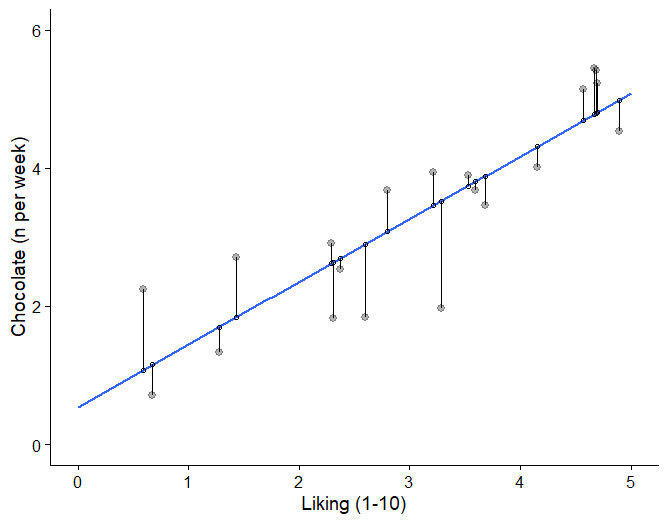
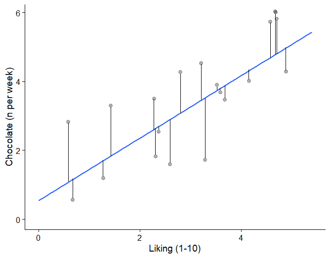
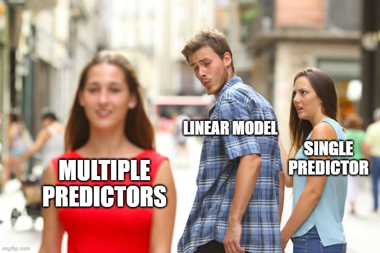
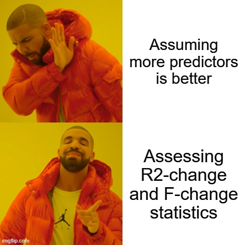

## Overview 

```{r setup, include=FALSE, message=F, warning=FALSE}
knitr::opts_chunk$set(echo = FALSE, message = F, warning = F)
library(MASS)
library(tidyverse)
library(cowplot)
library(lm.beta)
library(broom)
library(weights)

to_math <- function(x) {
  gsub(" ", "\\\\ ", x)
}

# slidify("analysing_data/lectures/lec9.Rmd", "and", color = "#ba3e8a")
```

```{r eg1a_setup}
set.seed(42)
myN <- 20

choc.b0 <- 0.7
choc.b1 <- 0.9
#choc.b2 <- 1.37
choc.sigma <- 0.7

liking <- runif(myN, 0, 5)
lactose <- runif(myN, 0, 3)

eps <- rnorm(liking, 0, choc.sigma) 
choc = choc.b0 + choc.b1*liking + eps

choc.tib <- tibble(choc, liking, lactose)
choc.lm <- lm(choc ~ liking)
#choc.lm %>% summary()

choc.sum <- choc.tib %>% 
  summarise_at(c(1:2), .funs = c(mean = "mean", sd = "sd", max = "max", min = "min"))

choc.tib$predicted <- predict(choc.lm)
choc.tib$residuals <- residuals(choc.lm)
choc.tib$overallmean <- choc.sum$choc_mean
choc.ylim <- choc.sum$choc_max + 0.5
liking.xlim <- choc.sum$liking_max + 0.5

choc2.lm <- lm(overallmean ~ liking, choc.tib)
choc.tib$predicted2 <- predict(choc2.lm)
choc.tib$residuals2 <- residuals(choc2.lm)
```

```{r eg1b_setup}
set.seed(42)
myN <- 20

cabbage.b0 <- 0.7
cabbage.b1 <- 0.01
#cabbage.b2 <- 1.37
cabbage.sigma <- 0.7

liking <- runif(myN, 0, 5)
lactose <- rnorm(myN, 0, 3)

eps <- rnorm(liking, 0, cabbage.sigma)
cabbage = cabbage.b0 + cabbage.b1*liking + eps

cabbage.tib <- tibble(cabbage, liking)
cabbage.lm <- lm(cabbage ~ liking)
#cabbage.lm %>% summary()

cabbage.sum <- cabbage.tib %>% 
  summarise_at(c(1:2), .funs = c(mean = "mean", sd = "sd", max = "max", min = "min"))

cabbage.tib$predicted <- predict(cabbage.lm)
cabbage.tib$residuals <- residuals(cabbage.lm)
cabbage.tib$overallmean <- cabbage.sum$cabbage_mean
cabbage.ylim <- cabbage.sum$cabbage_max + 0.5
liking.xlim <- cabbage.sum$liking_max + 0.5

cabbage2.lm <- lm(overallmean ~ liking, cabbage.tib)
cabbage.tib$predicted2 <- predict(cabbage2.lm)
cabbage.tib$residuals2 <- residuals(cabbage2.lm)

#cabbage.lm %>% summary()
#cabbage.sum$cabbage_mean

scatter.cabbage.ssm <- cabbage.tib %>% 
  ggplot(aes(x = liking, y = cabbage)) +
  geom_point(alpha = .3, size = 2.5) +
  #xlim(0, 5) + ylim(0, 11) +
  labs(y = "Chocolate (n per week)", x = "Cabbage liking (1-10)") +
  stat_smooth(method =lm, fullrange = T, se = F) +
  # theme_cowplot()+
  #geom_segment(aes(xend = predicted2, yend = predicted)) +
  geom_hline(yintercept=cabbage.sum$cabbage_mean, linetype="dashed", color = "red") #+
#geom_point(aes(y = predicted), shape = 1) 
```

```{r eg1ab_plots}
meanmod.choc <- choc.tib %>% 
ggplot(aes(x = liking, y = choc)) +
# geom_point(alpha = .3, size = 2.5) +
ylim(0, choc.ylim) +
labs(y = "Chocolate (n per week)", x = "") +
# stat_smooth(method =lm, fullrange = T, se = F) +
geom_hline(yintercept=choc.sum$choc_mean, linetype="dashed", color = "red")
# theme_cowplot()
#geom_point(aes(y = predicted), shape = 1) 

scatter.choc <- choc.tib %>% 
  ggplot(aes(x = liking, y = choc)) +
  geom_point(alpha = .3, size = 2.5) +
  # xlim(0, liking.xlim) + ylim(0, choc.ylim) +
  #  ylim(0, choc.ylim) +
  labs(y = "Chocolate (n per week)", x = "Chocolate liking (1-10)") +
  #stat_smooth(method =lm, fullrange = T, se = F) +
  geom_hline(yintercept=choc.sum$choc_mean, linetype="dashed", color = "red")
  # theme_cowplot()
# geom_point(aes(y = predicted), shape = 1) 

scatter.choc.lm <- choc.tib %>% 
  ggplot(aes(x = liking, y = choc)) +
  geom_point(alpha = .3, size = 2.5) +
  xlim(0, liking.xlim) + ylim(0, choc.ylim) +
  labs(y = "Chocolate (n per week)", x = "Chocolate liking (1-10)") +
  stat_smooth(method =lm, fullrange = T, se = F) 
  # theme_cowplot()
#geom_segment(aes(xend = liking, yend = predicted2)) +
#geom_hline(yintercept=choc.sum$choc_mean, linetype="dashed", color = "red") +
#geom_point(aes(y = predicted2), shape = 1) 

scatter.choc.sst <- choc.tib %>% 
  ggplot(aes(x = liking, y = choc)) +
  geom_point(alpha = .3, size = 2.5) +
  # xlim(0, liking.xlim) + ylim(0, choc.ylim) +
  labs(y = "Chocolate (n per week)", x = "Chocolate liking (1-10)") +
  #stat_smooth(method =lm, fullrange = T, se = F) +
  # theme_cowplot()+
  geom_segment(aes(xend = liking, yend = predicted2)) +
  geom_hline(yintercept=choc.sum$choc_mean, linetype="dashed", color = "red") +
  geom_point(aes(y = predicted2), shape = 1) 

scatter.choc.ssr <- choc.tib %>% 
  ggplot(aes(x = liking, y = choc)) +
  geom_point(alpha = .3, size = 2.5) +
  #xlim(0, liking.xlim) + ylim(0, choc.ylim) +
  labs(y = "Chocolate (n per week)", x = "Chocolate liking (1-10)") +
  stat_smooth(method =lm, fullrange = T, se = F) +
  #geom_hline(yintercept=choc.sum$choc_mean, linetype="dashed", color = "red") +
  # theme_cowplot()+
  geom_segment(aes(xend = liking, yend = predicted)) +
  geom_point(aes(y = predicted), shape = 21, colour = "black", fill = "red",  size = 2) 

scatter.choc.ssm <- choc.tib %>% 
  ggplot(aes(x = liking, y = choc)) +
  geom_point(alpha = .3, size = 2.5) +
  #xlim(0, 5) + ylim(0, 11) +
  labs(y = "Chocolate (n per week)", x = "Chocolate liking (1-10)") +
  stat_smooth(method =lm, fullrange = T, se = F) +
  # theme_cowplot()+
  #geom_segment(aes(xend = predicted2, yend = predicted)) +
  geom_hline(yintercept=choc.sum$choc_mean, linetype="dashed", color = "red") #+
#geom_point(aes(y = predicted), shape = 1) 

```


```{r eg4_setup}
eg4.outcome = "happiness" #????
eg4.pred1 = "puppies"
eg4.pred2 = "fluffy"
eg4.pred3 = "dirt"
#eg4.pred2.short = "alternative medicine"
#eg4.pred2.med = "alternative medicine beliefs"

set.seed(42)
myN <- 20

eg4.b0 <- 4
eg4.b1 <- 1
eg4.b2 <- .2
eg4.b3 <- -.9
eg4.sigma <- 0.7

puppies <- rnorm(myN, 3, 2)
dirt <- rnorm(myN, 4.5, 1.8)
fluffy <- rnorm(myN, 4.5, 1.8)
eps <- rnorm(puppies, 0, eg4.sigma) 
happiness = eg4.b0 + eg4.b1*puppies + eg4.b2*fluffy + eg4.b3*dirt + eps

eg4.data.tib <- tibble(happiness, puppies, fluffy, dirt)
eg4.mod1.lm <- lm(happiness ~ puppies, data = eg4.data.tib)
eg4.mod2.lm <- lm(happiness ~ puppies + fluffy + dirt, data = eg4.data.tib)
#eg4.mod1.lm %>% summary()
#eg4.mod2.lm %>% summary()

eg4.sum <- eg4.data.tib %>% 
  summarise_at(c(1:3), .funs = c(mean = "mean", sd = "sd", max = "max", min = "min"))

eg4.mod2.stdbeta <- lm.beta::lm.beta(eg4.mod2.lm)
eg4.mod2.out <- broom::tidy(eg4.mod2.lm, conf.int = TRUE)
eg4.mod1.fit <-broom::glance(eg4.mod1.lm)
eg4.mod2.fit <-broom::glance(eg4.mod2.lm)
eg4.mod2.pred1.p <-  eg4.mod2.out$p.value[2]
eg4.mod2.pred2.p <-  eg4.mod2.out$p.value[3] 
eg4.mod2.pred3.p <-  eg4.mod2.out$p.value[4]
eg4.mod2.pred1.beta <-  eg4.mod2.out$estimate[2]
eg4.mod2.pred2.beta <-  eg4.mod2.out$estimate[3]
eg4.mod2.pred3.beta <-  eg4.mod2.out$estimate[4]
eg4.mod2.pred1.stdbeta <-  eg4.mod2.stdbeta$standardized.coefficients[2]
eg4.mod2.pred2.stdbeta <-  eg4.mod2.stdbeta$standardized.coefficients[3] 
eg4.mod2.pred3.stdbeta <-  eg4.mod2.stdbeta$standardized.coefficients[4] 

eg4.mod2.beta.largest.name <- ifelse(
  eg4.mod2.pred1.beta > eg4.mod2.pred2.beta & eg4.mod2.pred1.beta > eg4.mod2.pred3.beta, eg4.pred1,
  ifelse(eg4.mod2.pred2.beta > eg4.mod2.pred3.beta, eg4.pred2, 
         eg4.pred3))

eg4.mod2.beta.smallest.name <- ifelse(
  eg4.mod2.pred1.beta < eg4.mod2.pred2.beta & eg4.mod2.pred1.beta < eg4.mod2.pred3.beta, eg4.pred1,
  ifelse(eg4.mod2.pred2.beta < eg4.mod2.pred3.beta, eg4.pred2, 
         eg4.pred3))

eg4.mod2.stdbeta.largest.name <- ifelse(
  eg4.mod2.pred1.stdbeta > eg4.mod2.pred2.stdbeta & eg4.mod2.pred1.stdbeta > eg4.mod2.pred3.stdbeta, eg4.pred1,
  ifelse(eg4.mod2.pred2.stdbeta > eg4.mod2.pred3.stdbeta, eg4.pred2, 
         eg4.pred3))

eg4.mod2.stdbeta.smallest.name <- ifelse(
  eg4.mod2.pred1.stdbeta < eg4.mod2.pred2.stdbeta & eg4.mod2.pred1.stdbeta < eg4.mod2.pred3.stdbeta, eg4.pred1,
  ifelse(eg4.mod2.pred2.stdbeta < eg4.mod2.pred3.stdbeta, eg4.pred2, 
         eg4.pred3))

eg4.mod2.stdbeta.largest <- ifelse(
  eg4.mod2.pred1.stdbeta > eg4.mod2.pred2.stdbeta & eg4.mod2.pred1.stdbeta > eg4.mod2.pred3.stdbeta, eg4.mod2.pred1.stdbeta,
  ifelse(eg4.mod2.pred2.stdbeta > eg4.mod2.pred3.stdbeta, eg4.mod2.pred2.stdbeta, 
         eg4.mod2.pred3.stdbeta))

eg4.mod2.stdbeta.smallest <- ifelse(
  eg4.mod2.pred1.stdbeta < eg4.mod2.pred2.stdbeta & eg4.mod2.pred1.stdbeta < eg4.mod2.pred3.stdbeta, eg4.mod2.pred1.stdbeta,
  ifelse(eg4.mod2.pred2.stdbeta < eg4.mod2.pred3.stdbeta, eg4.mod2.pred2.stdbeta, 
         eg4.mod2.pred3.stdbeta))
```

```{r predVobs_setup}
pred_v_obs.scatter <- choc.tib %>% 
  ggplot(aes(x = liking, y = choc)) +
  geom_point(alpha = .3, size = 2.5) +
  # xlim(0, liking.xlim) + ylim(0, choc.ylim) +
  ylim(0, 6) +
  labs(y = "Outcome variable", x = "Predictor variable")
  #stat_smooth(method =lm, fullrange = T, se = F) +
  #geom_hline(yintercept=choc.sum$choc_mean, linetype="dashed", color = "red") +
  # theme_cowplot() 
  #geom_point(aes(y = predicted), shape = 1)
pred_v_obs.pred <- choc.tib %>% 
  ggplot(aes(x = liking, y = choc)) +
  geom_point(alpha = .3, size = 2.5) +
  # xlim(0, liking.xlim) + ylim(0, choc.ylim) +
  ylim(0, 6) +
  labs(y = "Outcome variable", x = "Predictor variable") +
  #stat_smooth(method =lm, fullrange = T, se = F) +
  #geom_hline(yintercept=choc.sum$choc_mean, linetype="dashed", color = "red") +
  # theme_cowplot() +
  geom_point(aes(y = predicted), shape = 21, colour = "black", fill = "red", size = 2.5) 
pred_v_obs.predlm <- choc.tib %>% 
  ggplot(aes(x = liking, y = choc)) +
  geom_point(alpha = .3, size = 2.5) +
  # xlim(0, liking.xlim) + ylim(0, choc.ylim) +
  ylim(0, 6) +
  labs(y = "Outcome variable", x = "Predictor variable") +
  stat_smooth(method =lm, fullrange = T, se = F) +
  #geom_hline(yintercept=choc.sum$choc_mean, linetype="dashed", color = "red") +
  # theme_cowplot() +
  geom_point(aes(y = predicted), shape = 21, colour = "black", fill = "red", size = 2.5) 
pred_v_obs.ssr <- choc.tib %>% 
  ggplot(aes(x = liking, y = choc)) +
  geom_point(alpha = .3, size = 2.5) +
  # xlim(0, liking.xlim) + ylim(0, choc.ylim) +
  ylim(0, 6) +
  labs(y = "Outcome variable", x = "Predictor variable") +
  stat_smooth(method =lm, fullrange = T, se = F) +
  #geom_hline(yintercept=choc.sum$choc_mean, linetype="dashed", color = "red") +
  # theme_cowplot() +
  geom_segment(aes(xend = liking, yend = predicted)) +
  geom_point(aes(y = predicted), shape = 21, colour = "black", fill = "red", size = 2.5) 
```

```{r regline_plane_setup}
regline1 <- choc.tib %>% 
  ggplot(aes(x = liking, y = choc)) +
  geom_point(alpha = .3, size = 2.5) +
  ylim(0, 6) +
  labs(y = "Outcome variable", x = "Predictor variable 1") +
  stat_smooth(method =lm, fullrange = T, se = F)
  # theme_cowplot() 
regline2 <- choc.tib %>% 
  ggplot(aes(x = lactose, y = choc)) +
  geom_point(alpha = .3, size = 2.5) +
  ylim(0, 6) +
  labs(y = "Outcome variable", x = "Predictor variable 2") +
  stat_smooth(method =lm, fullrange = T, se = F)
  # theme_cowplot()
```

```{r JM_report.p, include = F}
report.p <- function(x){
  ifelse(x > .001, paste0(" = ", weights::rd(x, 3)), "< .001")
}
```

## Overview 

- Week 8: The Linear Model
- TODAY: Extending the Linear Model
- [3 weeks for Spring vacation]
- Week 10: Effect sizes
- Week 11: Consolidation


## Linear Models (LM): recap

- Trying to make predictions about the world 
- Capture the relationship between predictor & outcome
- Linear model (line) is described by an intercept (*b*~0~) and a slope (*b*~1~)

$$Outcome = b_0 + b_1\times Predictor_1 + \varepsilon$$

- Use the model to see: 
    - *R*^2^: proportion of variance in outcome that model explains
    - *t*-statistic and associated *p*-value: is *b*~1~ different from 0?
    - Direction of relationship between predictor & outcome 

## Today's Topics 

- How good *is* our model? 
    - Our model vs the mean
    - Error in the model
- Throwing more predictors into the mix!
- Comparing hierarchical models
- Comparing predictors in a model
- Bringing it all together: what can our model tell us?

## How good *is* our model?

- A good linear model (LM):
    - Explains a lot about our outcome
    - Captures more than using the simplest model possible
    - Doesn't contain much error in prediction 

### Keep is simple, stupid: The mean model

{width=400px}


- We want a LM that explains more than the simplest model possible
- The simplest model is the **mean**...
    - Mean chocolate bars eaten per week is `r choc.sum$choc_mean %>% round(2)`  
    - Predict how much chocolate your neighbour eats a week... 

### Keep is simple, stupid: The mean model

- Let's plot this
    - Chocolate eaten is our outcome variable
    - Not a great model!
    
```{r F_vis_meanmod1}
meanmod.choc + 
  labs(y = "Chocolate (n per week)", x = " ") 
```

### Keep is simple, stupid: The mean model

- Let's add a predictor
- Error in model
    - Between prediction (using mean) and observed data 
    
```{r F_vis_meanmod2}
meanmod.choc +  
  geom_point(alpha = .3, size = 2.5) + 
  labs(y = "Chocolate (n per week)", x = "Chocolate liking (1-10)") 
  
```

### Keep is simple, stupid: The mean model

- Let's add a predictor
- Error in model
    - Between prediction (using mean) and observed data 

```{r F_vis_meanmod3}
meanmod.choc + geom_point(alpha = .3, size = 2.5) +
  labs(y = "Chocolate (n per week)", x = "Chocolate liking (1-10)") +
  geom_segment(aes(xend = liking, yend = predicted2)) +
  geom_point(aes(y = predicted2), shape = 1) 
```


### We can do better, probably...

- Let's construct a LM between chocolate liking and eating
    - The line explaining our data with the least error
    - Compare to the line representing our mean model
    - Shows the **improvement in prediction** from LM (vs mean)

```{r F_vis_reg_ssm1}
scatter.choc.lm
```

### We can do better, probably...

- Let's construct a LM between chocolate liking and eating
    - The line explaining our data with the least error
    - Compare to the line representing our mean model
    - Shows the **improvement in prediction** from fitting a LM 

```{r F_vis_reg_ssm2}
scatter.choc.lm + 
  geom_hline(yintercept=choc.sum$choc_mean, linetype="dashed", color = "red") 
```

### We can do better, probably...

- Larger difference = greater improvement!
- We want a LM that **explains more** than the mean model

```{r F_vis_ssm_size_compare, fig.width=8}
plot_grid(scatter.choc.ssm, scatter.cabbage.ssm)
```


### Interim summary

- Is our LM is better than the simplest model possible?
    - The mean model is the simplest model     
    - We want a LM that **explains more** than the mean model
- But...a LM better than the mean still contains error
- How much error is okay?
    - Does the model explain more than it doesn't explain?
    - How well does the LM predict the outcome?

### Error in the model

- No model will fit the data perfectly
- Fit a line to **best** capture relationships between variables
- Want the **least error** possible 
    - Compare predicted and observed data points

### Error in the model


\ 

<section style="text-align: center;">


</section>


### Bringing it all together: the *F*-statistic

- This is the *F*-statistic!

$$F =\frac{what\ the\ model\ can\ explain}{what\ the\ model\ cannot\ explain}=\frac{signal}{noise}$$

- We want **signal** to be as big as possible
- We want **noise** to be as small as possible

### Bringing it all together: the *F*-statistic

- A **ratio** of ***variance explained*** relative to ***varience unexplained***
- Ratio > 1 means our model can explain more than it cannot explain
- Associated *p*-value of how likely we are to find a *F*-statistic as large as the observed if the null hypothesis is true 


## Why you gotta complicate things?

{width=400px}

\ 

- Multiple predictors are **not** much more complicated!
  - We build models to predict what is happening in the world
- Simple explainations for complex relationships?  
- Multiple predictors = greater explanatory power 
  
### How multiple predictors (don't really) change the LM equation 

$$\begin{aligned}Outcome &= Model + Error\\
Y&=b_0 + b_1\times Predictor_1 + \varepsilon\\
&=b_0 + b_1\times Predictor_1 + b_2\times Predictor_2 + \varepsilon\end{aligned}$$

  
- Y: outcome  
- *b*~0~: value of outcome when predictors are 0 (the intercept)  
- *b*~1~: change in outcome associated with a unit change in predictor 1
- *b*~2~: change in outcome associated with a unit change in predictor 2 

## How multiple predictors (don't really) change the LM equation

- One predictor LM = regression line
- Two+ predictor LM = regression plane

<div class="plot_ly">
<iframe frameborder="0" seamless='seamless' scrolling=no style="height: 500px" src="https://mivalek.github.io/adata/plot_3d.html"></iframe>
</div>


## Puppies, puppies everywhere!

The outcome:
{width=400px}


## Puppies, puppies everywhere!

Predictor 1:
{width=400px}

## Puppies, puppies everywhere!

Predictor 2:
{width=400px}

## Puppies, puppies everywhere!

$$`r to_math(eg4.outcome)`\ =\ b_0 + b_1\times `r to_math(eg4.pred1)`\ +\ b_2\times `r to_math(eg4.pred2)` + \varepsilon$$

- Y: `r eg4.outcome`  
- *b*~0~: value of `r eg4.outcome` when `r eg4.pred1` and `r eg4.pred2`  are 0 (the intercept)  
- *b*~1~: change in `r eg4.outcome` associated with a unit change in `r eg4.pred1` when `r eg4.pred2` is 0
- *b*~2~: change in `r eg4.outcome` associated with a unit change in `r eg4.pred2` when `r eg4.pred1` is 0

## Model fit: *F*-statistic

```{r puppy_m1, echo = T}
# fit the linear model
eg4.mod1.lm <- lm(happiness ~ puppies + fluffy, data = eg4.data.tib)
# get fit statistics
broom::glance(eg4.mod1.lm)
```


- The *F*-statistic is `r eg4.mod1.fit$statistic %>% round(2)`
- The associated p-value is `r eg4.mod1.fit$p.value %>% report.p`
    - Adding predictors significantly improved model fit
    - Explained significantly more variance than could not explain

## Model fit: *R*^2^ value

```{r puppy_m1.2, echo = T}
# fit the linear model
eg4.mod1.lm <- lm(happiness ~ puppies + fluffy, data = eg4.data.tib)
# get fit statistics
broom::glance(eg4.mod1.lm)
```

- The *R*^2^ is `r eg4.mod1.fit$r.squared %>% round(2)` 
    - `r eg4.mod1.fit$r.squared %>% round(2) * 100`% of the variance in `r eg4.outcome` was explained by `r eg4.pred1` **and** `r eg4.pred2` ratings
    
- This is just in our observed data!
- Our adjusted *R*^2^ value was `r eg4.mod1.fit$adj.r.squared %>% round(3)`
    - If we used the same model with the population, we should be able to explain `r eg4.mod1.fit$adj.r.squared %>% round(2) * 100`% of the variance in `r eg4.outcome`


## Interim summary, mark II 

- The LM can be expanded to include additional predictors
- The model is still described by an intercept (*b*~0~) 
- It now includes slopes (*b*s) for *each* predictor
- This creates a regression plane instead of a line
- We can assess how good this model is 
    - *F*-ratio and associated *p*-value
    - *R*^2^
- What if we want to compare two linear models?

## Comparing linear models

- We can compare models with different numbers of predictors
    - See which model better captures our outcome
    - The models must be 'hierarchical'
        - 2^nd^ model has the same predictors as the 1^st^ model plus extra
        - 3^rd^ model has the same predictors as the 2^nd^ model plus extra
          
## Even more puppies!

Predictor 3:
{width=400px}


## Even more puppies!

Model 1:

$$\begin{aligned}`r to_math(eg4.outcome)`\ = &\ b_0\ +\\&\ b_1\times `r to_math(eg4.pred1)`\ +\\ &\ b_2\times `r to_math(eg4.pred2)` + \varepsilon\end{aligned}$$

Model 2:

$$\begin{aligned}`r to_math(eg4.outcome)`\ = &\ b_0\ +\\&\ b_1\times `r to_math(eg4.pred1)`\ +\\ &\ b_2\times `r to_math(eg4.pred2)`\ +\\ &\ b_3\times `r to_math(eg4.pred3)` + \varepsilon\end{aligned}$$

## Even more puppies!

```{r eg4_lm, echo = T}

# Model 1
eg4.mod1.lm <- lm(happiness ~ puppies + fluffy, data = eg4.data.tib)

# Model 2
eg4.mod2.lm <- lm(happiness ~ puppies + fluffy + dirt, data = eg4.data.tib)
```

- First, which is the **better** model?
- Second, **how useful** is the best model?

## With great (predictive) power comes great responsibility

- Need to assess which is the best model
- Want to *compare* Model 1 (2 predictors) and Model 2 (3 predictors)
    - Do extra predictors improve the model?
    - Look at ***R*^2^-change** and ***F*-change**
  

## With great (predictive) power comes great responsibility

{width=400px}


### R^2^-change

Model 1:

```{r eg4_fit.m1, echo = T}
broom::glance(eg4.mod1.lm)
```

\ 

Model 2:

```{r eg4_fit.m2, echo = T}
broom::glance(eg4.mod2.lm)
```


### R^2^-change

- The R^2^ for Model 2 is `r eg4.mod2.fit$r.squared %>% round(2)` 
    - `r eg4.mod2.fit$r.squared %>% round(2) * 100`% of the variance in `r eg4.outcome` is explained by `r eg4.pred1` *and* `r eg4.pred2`. 

### R^2^-change

- We can calculate the *change* in R^2^ between Model 1 and Model 2
    - `r eg4.mod2.fit$r.squared %>% round(2)` - `r eg4.mod1.fit$r.squared %>% round(2)` = `r (eg4.mod2.fit$r.squared %>% round(2)) - (eg4.mod1.fit$r.squared %>% round(2))`
    - Model 2 explains `r ((eg4.mod2.fit$r.squared %>% round(2)) - (eg4.mod1.fit$r.squared %>% round(2)))*100`% more variance than Model 1
    - We accounted for `r ((eg4.mod2.fit$r.squared %>% round(2)) - (eg4.mod1.fit$r.squared %>% round(2)))*100`% more variance in `r eg4.outcome` by adding `r eg4.pred3` to the model 
    
### *F*-change

``` {r eg4_anova,  echo = T}
eg4.anova <- anova(eg4.mod1.lm,eg4.mod2.lm) %>% broom::tidy()
eg4.anova
```

- Does Model 2 explain more variance compared to Model 1?
    - Does adding more predictors significantly improve model fit?
- The *F*-change statistic is `r eg4.anova$statistic[2] %>% round(2)` with a *p*-value of `r eg4.anova$p.value[2] %>% report.p`
- Model 2 was *significantly better* at explaining variability in `r eg4.outcome` than Model 1
    
### Relative contribution of predictor variables

- Now we know Model 2 is the best model...
- Which predictors explain **most** variance in the outcome variable?
    - Assess the **relative contribution** of our predictor variables
    - Look at the *b*-values and associated *p*-values for each predictor

## Number of puppies...

```{r}
eg4.mod2.out <- broom::tidy(eg4.mod2.lm, conf.int = TRUE)
```

```{r DO_MOD_NAME, echo = T}
broom::tidy(eg4.mod2.lm, conf.int = TRUE)
```

- `r eg4.pred1` `r ifelse(eg4.mod2.pred1.p < .05, "significantly predicted", "did not significantly predict")` `r eg4.outcome` 
    - *b*~1~ is `r ifelse(eg4.mod2.pred1.beta > 0, "positive", "negative")`: as `r eg4.pred1` increases, `r eg4.outcome` `r ifelse(eg4.mod2.pred1.beta > 0, "increases", "decreases")`
    - For every unit increase in `r eg4.pred1`, `r eg4.outcome` `r ifelse(eg4.mod2.pred1.beta > 0, "increases", "decreases")` by `r eg4.mod2.out$estimate[2] %>%  round(2)` units 
    - When all other predictors are held constant!

## Fluffiness of puppies...

```{r DO_MOD_NAME_2, echo = T}
broom::tidy(eg4.mod2.lm, conf.int = TRUE)
```

- `r eg4.pred2` `r ifelse(eg4.mod2.pred2.p < .05, "significantly predicted", "did not significantly predict")` `r eg4.outcome` 
    - *b*~2~ is `r eg4.pred2` is a `r ifelse(eg4.mod2.pred2.beta > 0, "positive", "negative")`: as `r eg4.pred2` increases, `r eg4.outcome` `r ifelse(eg4.mod2.pred2.beta > 0, "increases", "decreases")`
    - For every unit increase in `r eg4.pred2`, `r eg4.outcome` `r ifelse(eg4.mod2.pred2.beta > 0, "increases", "decreases")` by `r eg4.mod2.out$estimate[3] %>%  round(2)` units 

## Dirtiness of puppies...

```{r DO_MOD_NAME_3, echo = T}
broom::tidy(eg4.mod2.lm, conf.int = TRUE)
```

- `r eg4.pred3` `r ifelse(eg4.mod2.pred3.p < .05, "significantly predicted", "did not significantly predict")` `r eg4.outcome` 
    - *b*~3~ is `r eg4.pred3` is a `r ifelse(eg4.mod2.pred3.beta > 0, "positive", "negative")`: as `r eg4.pred3` increases, `r eg4.outcome` `r ifelse(eg4.mod2.pred3.beta > 0, "increases", "decreases")`
    - For every unit increase in `r eg4.pred3`, `r eg4.outcome` `r ifelse(eg4.mod2.pred3.beta > 0, "increases", "decreases")` by `r eg4.mod2.out$estimate[4] %>%  round(2)` units 
    
## Relative contribution of predictor variables

- We **CANNOT** interpret the relative contribution from these *b*s! 
- We can't say that `r eg4.mod2.beta.largest.name` caused `r eg4.outcome` to change by a greater amount than `r eg4.mod2.beta.smallest.name`
    - All predictors were measured in different units
    - We can only compare predictors measured in the same unit (e.g. cm or £) 
    
## Relative contribution of predictor variables

- Instead, need to look at **standardized** versions of our betas
    - These are 'measured' in **standard deviations**
- **Unstandardized *b*~1~** = number of **units** that `r eg4.outcome` `r ifelse(eg4.mod2.pred1.beta > 0, "increases", "decreases")` for every unit increase in `r eg4.pred1`
- **Standardized *b*~1~** = number of **standard deviations** (*SD*s) that `r eg4.outcome` `r ifelse(eg4.mod2.pred1.beta > 0, "increases", "decreases")` for every standard deviation increase in `r eg4.pred1`
  
## Relative contribution of predictor variables  

```{r eg4_lm.beta, echo = T}
lm.beta::lm.beta(eg4.mod2.lm)
```

- The standardized beta for `r eg4.pred1` (standardized *b*~1~) is `r eg4.mod2.stdbeta$standardized.coefficients[2] %>% round(2)`
    - As `r eg4.pred1` increase by 1 *SD*, `r eg4.outcome` `r ifelse(eg4.mod2.pred1.stdbeta > 0, "increases", "decreases")` by `r eg4.mod2.stdbeta$standardized.coefficients[2] %>% round(2)` *SD*s

- The standardized beta for `r eg4.pred2` (standardized *b*~2~) is `r eg4.mod2.stdbeta$standardized.coefficients[3] %>% round(2)`
    - As `r eg4.pred2` increases by 1 *SD*, `r eg4.outcome` `r ifelse(eg4.mod2.pred2.stdbeta > 0, "increases", "decreases")` by `r eg4.mod2.stdbeta$standardized.coefficients[3] %>% round(2)` *SD*s

## Relative contribution of predictor variables  

```{r eg4_lm.beta2, echo = T}
lm.beta::lm.beta(eg4.mod2.lm)
```

- The standardized beta for `r eg4.pred3` (standardized *b*~2~) is `r eg4.mod2.stdbeta$standardized.coefficients[4] %>% round(2)`
    - As `r eg4.pred3` increases by 1 *SD*, `r eg4.outcome` `r ifelse(eg4.mod2.pred3.stdbeta > 0, "increases", "decreases")` by `r eg4.mod2.stdbeta$standardized.coefficients[4] %>% round(2)` *SD*s

### Relative contribution of predictors

```{r, echo = T}
lm.beta::lm.beta(eg4.mod2.lm)
```

- All predictors (*b*s) are now in the same unit - standard deviations - Now we can **directly compare** their relative contribution 
- `r eg4.mod2.stdbeta.largest %>%  round(2)` is the largest standardized beta
- So each *SD* `r ifelse(eg4.mod2.stdbeta.largest > 0, "increase", "decrease")` in `r eg4.mod2.stdbeta.largest.name` predicts a larger *SD* change in `r eg4.outcome` than the other predictors


### Summary

- Run hierarchical models
- Assess if either model is better than the mean model:
    - *F*-statistic and associated *p*-value
- Assess which is better model
    - *R*^2^-change, *F*-change statistic and associated *p*-value
- Assess which variables significantly predict the outcome
    - *t*-value and associated *p*-value
- Assess which variables have largest  contribution to the outcome
    - Standardized *b*s


## Overall summary

- The LM captures the relationship between at one or more predictors, *x*, and an outcome, *y*
    - LM equation: Outcome = *b*~0~ + *b*~1~ &times; Predictor 1 + *b*~2~&times; Predictor 2 + *b*~n~ &times; Predictor *n*... + Error
- Is our model useful? Assess model fit:
    - *F*-statistic (or *F*-change) and associated *p*-value 
    - *R*^2^ (or *R*^2^-change)
- What does our model tell us? 
    - Unstandardized *b*s, *t*-statistic and associated *p*-value
    - Standardized *b*s 


