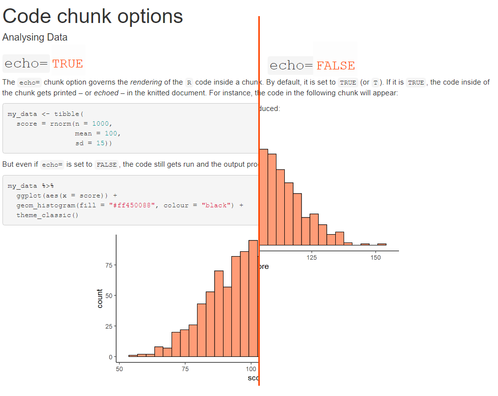
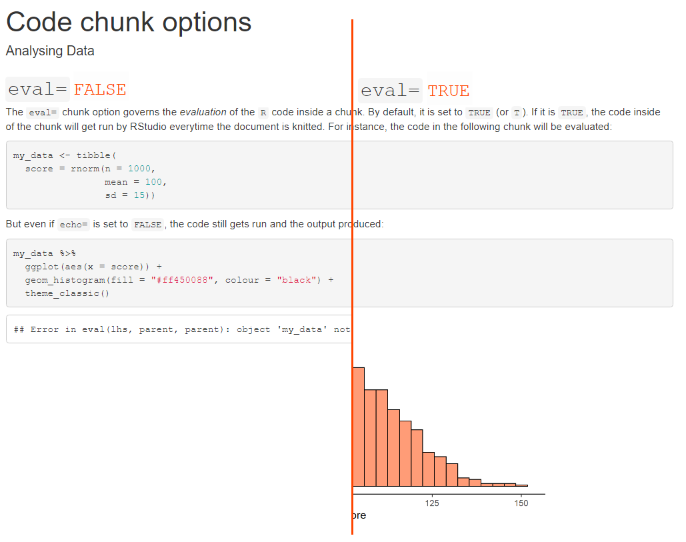
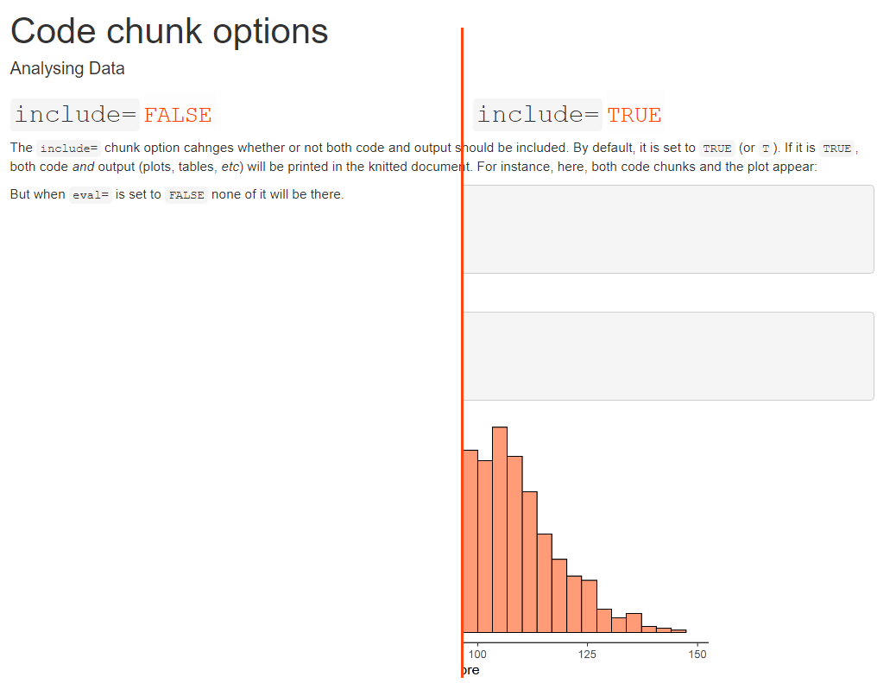

## Today's Goals

- Consolidate what you've learnt about R Markdown
- Closer look at code chunk options
- Further YAML arguments for customised documents
- Rmd tricks
- First steps towards writing papers/reports

## Setup

Just like last time, before we start, make sure to:

- Log into OneDrive and Canvas
- Open RStudio via the Software Hub
- Open the Analysing Data project file
- Open the worksheet
- Download the R Markdown file into your r_docs folder in your R project
<!-- - Run the first (setup) code chunk -->

## Question time

- Any questions about last weeks' content before quiz?

## Week 2 quiz

- 7 (9) minutes
- **Marked**
- Phones face down / away
- No talking
- Only physical calculator / desktop app allowed

## Week 2 quiz

<script src="https://mivalek.github.io/slides_files/js/quiz_timer.js"></script>
<div class="quiz">
<p id="timer" onclick="quizTimer(7); this.onclick=null">Get ready</p>
</div>

## Rmd code chunks

### Chunk options

- Blocks of `R` code fenced off using

<pre><code>
&#96;&#96;&#96;{r [optional label], [chunk options]}

[some R code]

&#96;&#96;&#96;
</code></pre>

- Labels are arbitrary
- Options change the look of the chunk's result
    - Different options are useful for different things
    - We will only look at the three most commonly used
    
### `echo=`

{height="550px"}

### `eval=`

{height="550px"}


### `include=`

{height="530px"}

### Usage

- `include=F`
    - For code whose output you never want to show
    - <i>e.g.,</i> `library()` calls, data processing and analysis code, or setup chunks
- `echo=F`
    - When you want output but not the code
    - <i>e.g.,</i> plots and tables
- `eval=F`; `echo=T`
    - When you want to demonstrate code but don't want to run it (rarely)

### Setting options **globally**

- The setup chunk that gets put into every new Rmd file can be edited to set global options
- You can just change/add the `echo=`, `eval=`, `include=`, and other options

<pre><code>
&#96;&#96;&#96;{r setup, include = FALSE}
knitr::opts_chunk$set(echo = FALSE, include = FALSE)
&#96;&#96;&#96;
</code></pre>

### Setting options **locally**

- Any *individual* code chunk can be given its own options
- This **overrides any global options**
- Even if `echo=` is set globally to `FALSE`, the following chunk gets echoed in the knitted document

<pre><code>
&#96;&#96;&#96;{r demo_chunk, echo=T}
my_data <- tibble(
  score = rnorm(n = 1000,
                mean = 100,
                sd = 15))
&#96;&#96;&#96;
</code></pre>

## Using the YAML header

### `html_document:` options

- Output format can be modified using options
- To do that, `html_document:` must be on a *new, indented* line, followed by a colon `:`
- Further options must be also on a new line and indented

```
---
title: "Code chunk options"
author: "Analysing Data"
output:
  html_document:
    option_1: some_value
    option_2: some_value
---
```

#### `toc: true` option

```
---
title: "Code chunk options"
author: "Analysing Data"
output:
  html_document:
    toc: true
---
```

<iframe class="stretch" data-src="https://mivalek.github.io/adata/misc/code_chunks_toc.html"></iframe>

#### `toc_float: true` option

```
---
title: "Code chunk options"
author: "Analysing Data"
output:
  html_document:
    toc: true
    toc_float: true
---
```

<iframe class="stretch" data-src="https://mivalek.github.io/adata/misc/code_chunks_float.html"></iframe>

#### `number_sections: true` option

```
---
title: "Code chunk options"
author: "Analysing Data"
output:
  html_document:
    number_sections: true
---
```

<iframe class="stretch" data-src="https://mivalek.github.io/adata/misc/code_chunks_num.html"></iframe>

#### `theme:` option

```
---
title: "Code chunk options"
author: "Analysing Data"
output:
  html_document:
    theme: darkly
---
```

<iframe class="stretch" data-src="https://mivalek.github.io/adata/misc/code_chunks_theme.html"></iframe>

## Take-home message

- Chunk options can change whether or not:
  - Code chunks get *echoed*
  - Code gets *evaluated*
  - Code and output are *included*
- There are further options [(see here)](https://yihui.org/knitr/options/#chunk-options)
- There are many YAML options to customise the formatting of the document, <i>e.g.</i>:
  - Table of contents, including float
  - Numbering of sections
  - Themes
- Many other YAML options [(see here)](https://bookdown.org/yihui/bookdown/yaml-options.html)
  
## Over to you

[Click here for today's tasks](prac_02_wkst.html#worksheet)
